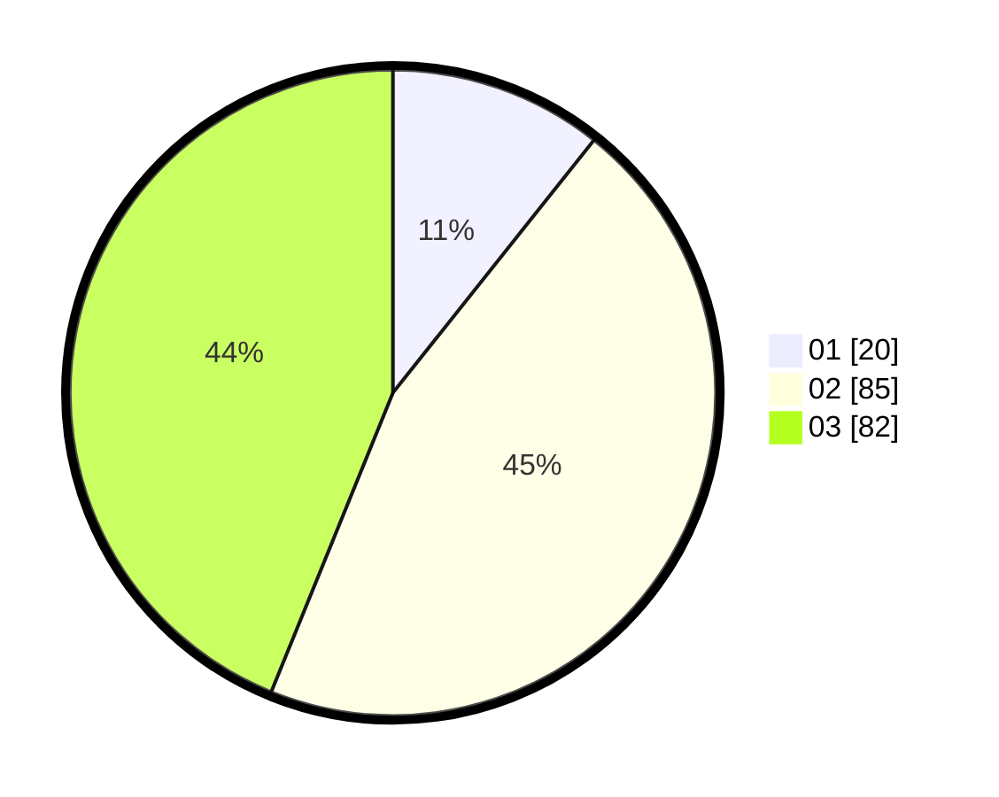

# Hasil

Hasil perolehan suara paslon dapat dilihat pada file paslon-01.txt, paslon-02.txt, dan paslon-03.txt.

Jika tidak ada, artinya data tersebut belum ada pada SIREKAP.

## Perolehan Suara

 * Paslon 01: **20**.
 * Paslon 02: **85**.
 * Paslon 03: **82**.

## Foto C Plano

https://sirekap-obj-formc.kpu.go.id/33ad/pemilu/ppwp/31/73/03/10/03/3173031003038-20240214-214816--4e73f5d9-a73a-4199-8429-6b9855040636.jpg

https://sirekap-obj-formc.kpu.go.id/33ad/pemilu/ppwp/31/73/03/10/03/3173031003038-20240214-214955--0b2d47d1-aeee-4863-86d6-c932a486a4dc.jpg

https://sirekap-obj-formc.kpu.go.id/33ad/pemilu/ppwp/31/73/03/10/03/3173031003038-20240214-215132--9889fbcc-2258-44c9-9055-f65c606b2ee3.jpg
