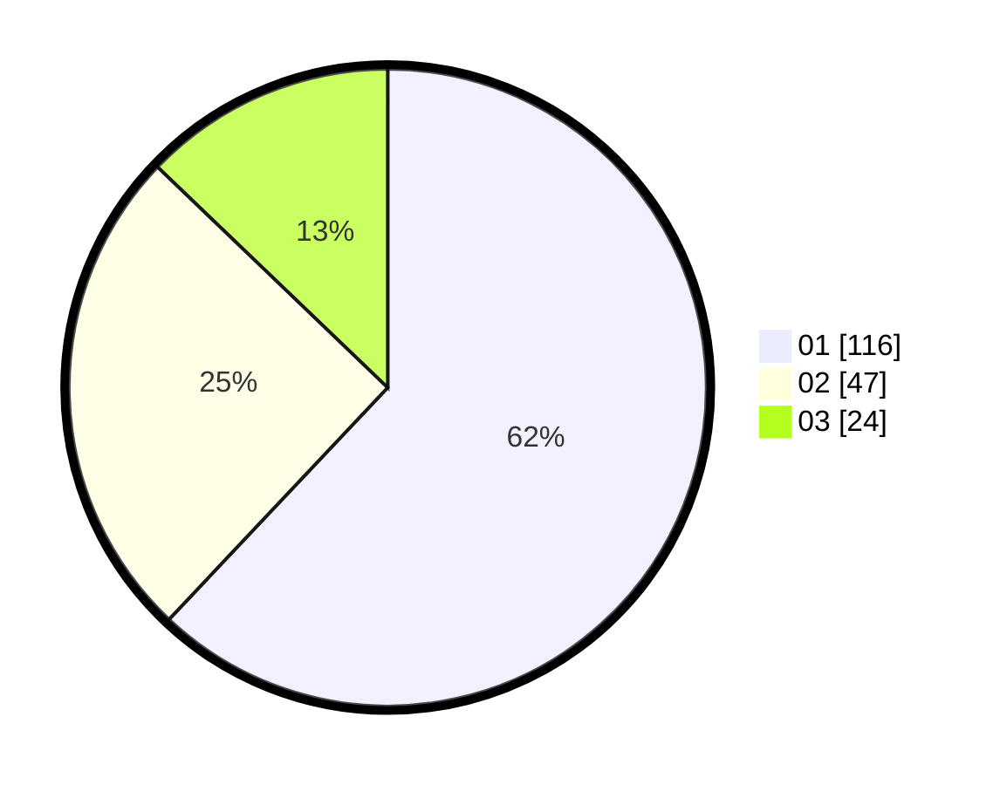

# Hasil

Hasil perolehan suara paslon dapat dilihat pada file paslon-01.txt, paslon-02.txt, dan paslon-03.txt.

Jika tidak ada, artinya data tersebut belum ada pada SIREKAP.

## Perolehan Suara

 * Paslon 01: **116**.
 * Paslon 02: **47**.
 * Paslon 03: **24**.

## Foto C Plano

https://sirekap-obj-formc.kpu.go.id/9693/pemilu/ppwp/31/73/03/10/03/3173031003042-20240214-190325--ddde7a5b-b4fc-4543-9b7a-dad5f23c02ca.jpg

https://sirekap-obj-formc.kpu.go.id/9693/pemilu/ppwp/31/73/03/10/03/3173031003042-20240214-190440--5d20cde5-216c-4911-b780-4206b80dda80.jpg
