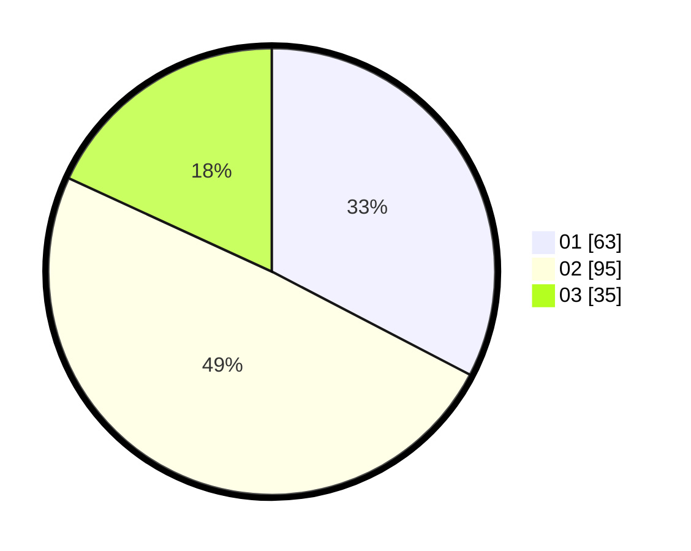

# Hasil

Hasil perolehan suara paslon dapat dilihat pada file paslon-01.txt, paslon-02.txt, dan paslon-03.txt.

Jika tidak ada, artinya data tersebut belum ada pada SIREKAP.

## Perolehan Suara

 * Paslon 01: **63**.
 * Paslon 02: **95**.
 * Paslon 03: **35**.

## Foto C Plano

https://sirekap-obj-formc.kpu.go.id/e5a8/pemilu/ppwp/31/73/03/10/03/3173031003048-20240214-234448--361c15d8-3934-4946-bc85-c3dfbf73d396.jpg

https://sirekap-obj-formc.kpu.go.id/e5a8/pemilu/ppwp/31/73/03/10/03/3173031003048-20240214-234644--407077ae-bf74-4545-8c48-5b5220aa6ea1.jpg

https://sirekap-obj-formc.kpu.go.id/e5a8/pemilu/ppwp/31/73/03/10/03/3173031003048-20240214-234835--eb65fc7e-241f-4f2f-a42b-6327a1fc78ec.jpg
