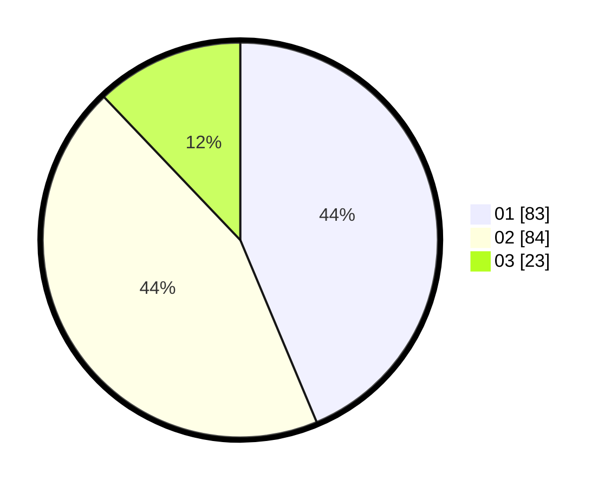

# Hasil

Hasil perolehan suara paslon dapat dilihat pada file paslon-01.txt, paslon-02.txt, dan paslon-03.txt.

Jika tidak ada, artinya data tersebut belum ada pada SIREKAP.

## Perolehan Suara

 * Paslon 01: **83**.
 * Paslon 02: **84**.
 * Paslon 03: **23**.

## Foto C Plano

https://sirekap-obj-formc.kpu.go.id/2db6/pemilu/ppwp/31/73/03/10/03/3173031003051-20240214-221026--a9dd85a8-c064-4a1f-b8c5-60bcb02dc235.jpg

https://sirekap-obj-formc.kpu.go.id/2db6/pemilu/ppwp/31/73/03/10/03/3173031003051-20240214-221112--b7b3757e-3385-424f-a63c-0d861ed8d3fb.jpg
