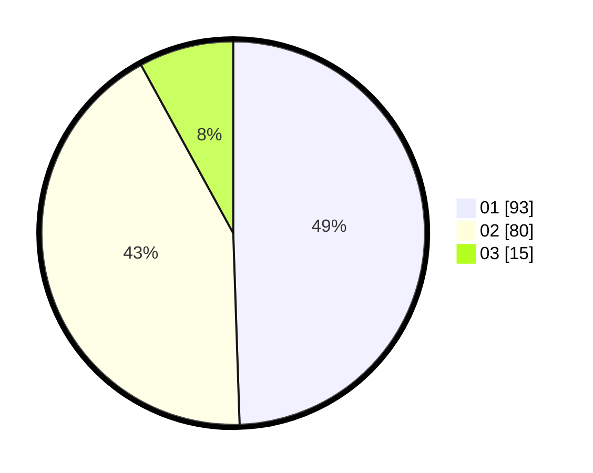

# Hasil

Hasil perolehan suara paslon dapat dilihat pada file paslon-01.txt, paslon-02.txt, dan paslon-03.txt.

Jika tidak ada, artinya data tersebut belum ada pada SIREKAP.

## Perolehan Suara

 * Paslon 01: **93**.
 * Paslon 02: **80**.
 * Paslon 03: **15**.

## Foto C Plano

https://sirekap-obj-formc.kpu.go.id/0ca3/pemilu/ppwp/31/73/03/10/03/3173031003052-20240214-213011--f4e2c461-f555-40de-95f4-c0612cd3dda9.jpg

https://sirekap-obj-formc.kpu.go.id/0ca3/pemilu/ppwp/31/73/03/10/03/3173031003052-20240214-222907--4dc539b0-8db5-4b32-b7d2-fd2f49f894b3.jpg

https://sirekap-obj-formc.kpu.go.id/0ca3/pemilu/ppwp/31/73/03/10/03/3173031003052-20240214-213401--7d931f2d-579a-448a-8f42-7c8cdc12b082.jpg
