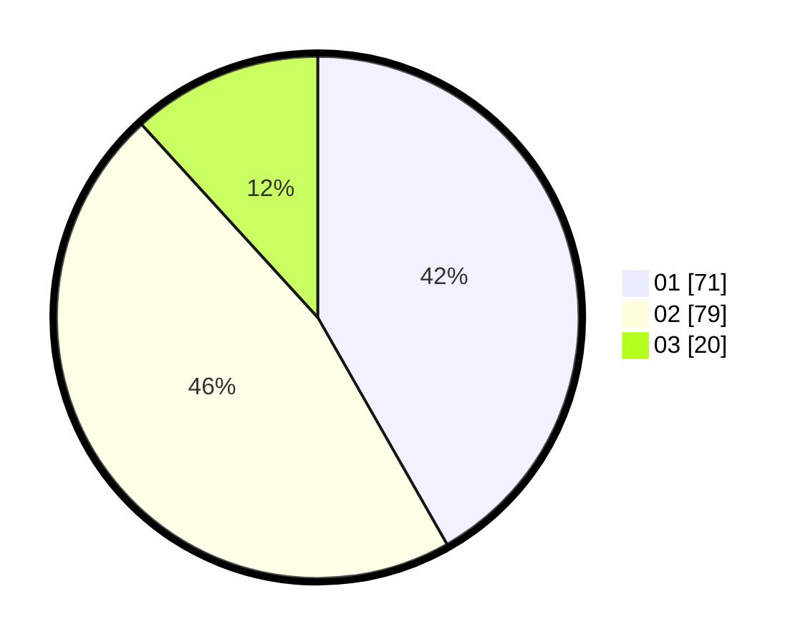

# Hasil

Hasil perolehan suara paslon dapat dilihat pada file paslon-01.txt, paslon-02.txt, dan paslon-03.txt.

Jika tidak ada, artinya data tersebut belum ada pada SIREKAP.

## Perolehan Suara

 * Paslon 01: **71**.
 * Paslon 02: **79**.
 * Paslon 03: **20**.

## Foto C Plano

https://sirekap-obj-formc.kpu.go.id/659f/pemilu/ppwp/31/73/03/10/03/3173031003057-20240215-215734--03aec901-9aac-4af3-9a35-9ba6505b6281.jpg

https://sirekap-obj-formc.kpu.go.id/659f/pemilu/ppwp/31/73/03/10/03/3173031003057-20240215-215618--49a49c28-fb79-46d5-9019-8cec26c14458.jpg
