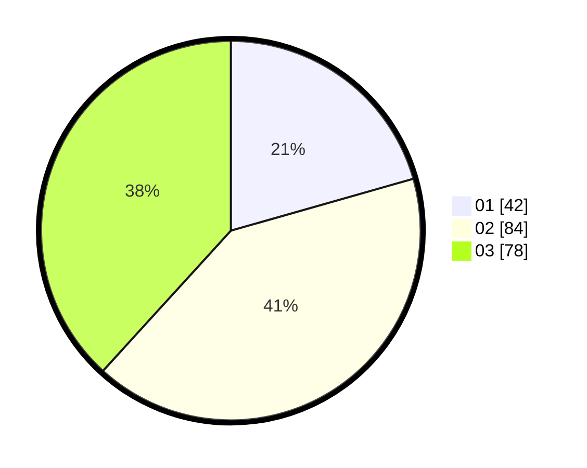

# Hasil

Hasil perolehan suara paslon dapat dilihat pada file paslon-01.txt, paslon-02.txt, dan paslon-03.txt.

Jika tidak ada, artinya data tersebut belum ada pada SIREKAP.

## Perolehan Suara

 * Paslon 01: **42**.
 * Paslon 02: **84**.
 * Paslon 03: **78**.

## Foto C Plano

https://sirekap-obj-formc.kpu.go.id/11ae/pemilu/ppwp/31/73/03/10/04/3173031004002-20240214-203859--a442ecbc-a1ef-47d5-9792-01790cd976cb.jpg

https://sirekap-obj-formc.kpu.go.id/11ae/pemilu/ppwp/31/73/03/10/04/3173031004002-20240214-215224--bf69f0d4-9778-4c58-8d30-eb3521ec8c86.jpg

https://sirekap-obj-formc.kpu.go.id/11ae/pemilu/ppwp/31/73/03/10/04/3173031004002-20240214-204204--ea967f2c-3bd1-4942-9ac1-06c2b99bb2ee.jpg

## DATA PEMILIH TETAP

Jumlah pemilih dalam DPT: **262**.
 * L: **130**.
 * P: **132**.

## DATA PENGGUNA HAK PILIH

Jumlah pengguna hak pilih dalam DPT: **209**.
 * L: **101**.
 * P: **108**.

Jumlah pengguna hak pilih dalam DPTb: **0**.
 * L: **0**.
 * P: **0**.

Jumlah pengguna hak pilih dalam DPK: **0**.
 * L: **0**.
 * P: **0**.

Jumlah pengguna hak pilih: **209**.
 * L: **101**.
 * P: **108**.

## JUMLAH SUARA SAH DAN TIDAK SAH

JUMLAH SELURUH SUARA SAH: **204**.

JUMLAH SUARA TIDAK SAH: **5**.

JUMLAH SELURUH SUARA SAH DAN SUARA TIDAK SAH: **209**.
