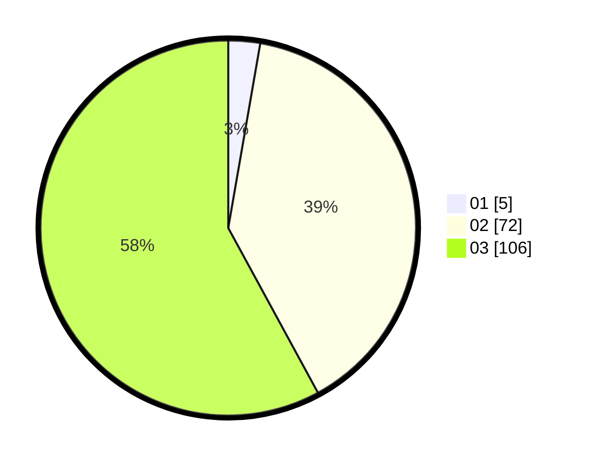

# Hasil

Hasil perolehan suara paslon dapat dilihat pada file paslon-01.txt, paslon-02.txt, dan paslon-03.txt.

Jika tidak ada, artinya data tersebut belum ada pada SIREKAP.

## Perolehan Suara

 * Paslon 01: **5**.
 * Paslon 02: **72**.
 * Paslon 03: **106**.

## Foto C Plano

https://sirekap-obj-formc.kpu.go.id/b7aa/pemilu/ppwp/31/73/03/10/04/3173031004006-20240214-155344--38835832-4675-42fc-9d4c-21fedc8d16a5.jpg

https://sirekap-obj-formc.kpu.go.id/b7aa/pemilu/ppwp/31/73/03/10/04/3173031004006-20240214-155517--77bf35b6-69df-41ac-b782-39e3e1a4b215.jpg

https://sirekap-obj-formc.kpu.go.id/b7aa/pemilu/ppwp/31/73/03/10/04/3173031004006-20240214-155834--5a2e0afa-1a8a-4b93-855b-4608ceb751e7.jpg
