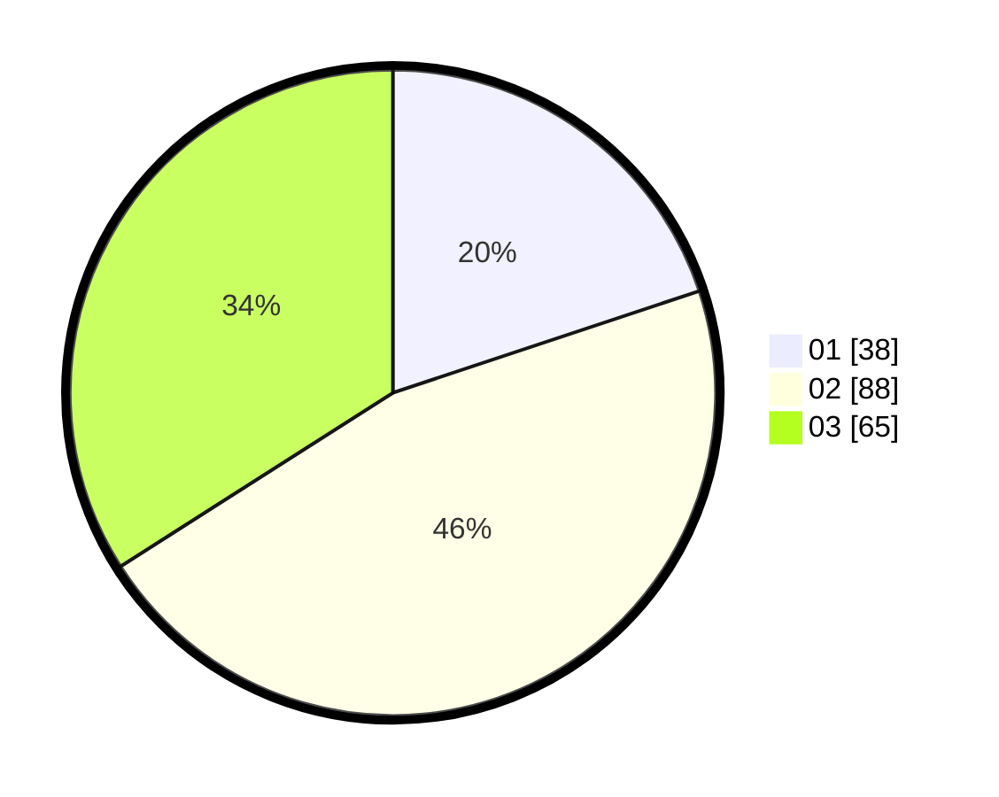

# Hasil

Hasil perolehan suara paslon dapat dilihat pada file paslon-01.txt, paslon-02.txt, dan paslon-03.txt.

Jika tidak ada, artinya data tersebut belum ada pada SIREKAP.

## Perolehan Suara

 * Paslon 01: **38**.
 * Paslon 02: **88**.
 * Paslon 03: **65**.

## Foto C Plano

https://sirekap-obj-formc.kpu.go.id/ab07/pemilu/ppwp/31/73/03/10/04/3173031004010-20240214-203345--7ebd8c43-5588-44af-936f-3198981878e1.jpg

https://sirekap-obj-formc.kpu.go.id/ab07/pemilu/ppwp/31/73/03/10/04/3173031004010-20240214-203450--770e228a-0161-454d-8da9-4672563aac4e.jpg

https://sirekap-obj-formc.kpu.go.id/ab07/pemilu/ppwp/31/73/03/10/04/3173031004010-20240214-190232--e82542f4-389b-4924-9f7a-81c7386043d0.jpg

## DATA PEMILIH TETAP

Jumlah pemilih dalam DPT: **262**.
 * L: **131**.
 * P: **131**.

## DATA PENGGUNA HAK PILIH

Jumlah pengguna hak pilih dalam DPT: **196**.
 * L: **100**.
 * P: **96**.

Jumlah pengguna hak pilih dalam DPTb: **0**.
 * L: **0**.
 * P: **0**.

Jumlah pengguna hak pilih dalam DPK: **0**.
 * L: **0**.
 * P: **0**.

Jumlah pengguna hak pilih: **196**.
 * L: **100**.
 * P: **96**.

## JUMLAH SUARA SAH DAN TIDAK SAH

JUMLAH SELURUH SUARA SAH: **191**.

JUMLAH SUARA TIDAK SAH: **5**.

JUMLAH SELURUH SUARA SAH DAN SUARA TIDAK SAH: **196**.
