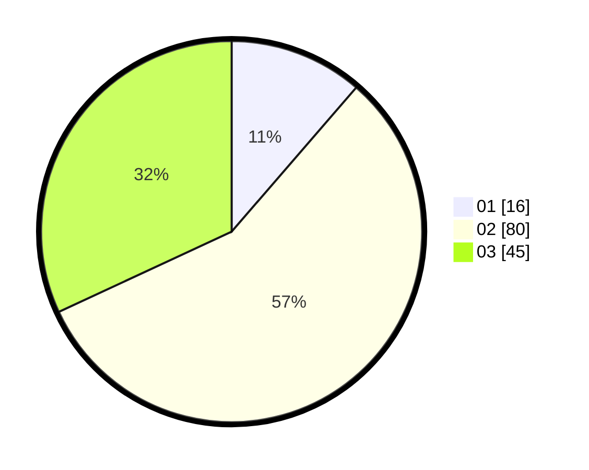

# Hasil

Hasil perolehan suara paslon dapat dilihat pada file paslon-01.txt, paslon-02.txt, dan paslon-03.txt.

Jika tidak ada, artinya data tersebut belum ada pada SIREKAP.

## Perolehan Suara

 * Paslon 01: **16**.
 * Paslon 02: **80**.
 * Paslon 03: **45**.

## Foto C Plano

https://sirekap-obj-formc.kpu.go.id/53a7/pemilu/ppwp/31/73/03/10/04/3173031004011-20240214-231209--5ae13c85-3c79-4b9e-bdbd-1cd86101d614.jpg

https://sirekap-obj-formc.kpu.go.id/53a7/pemilu/ppwp/31/73/03/10/04/3173031004011-20240214-231514--b461bb65-bf16-4a0b-b01b-417b68f56cb9.jpg

https://sirekap-obj-formc.kpu.go.id/53a7/pemilu/ppwp/31/73/03/10/04/3173031004011-20240214-231621--bd6cfb9d-a55f-4734-98b6-96c3399f8aee.jpg
