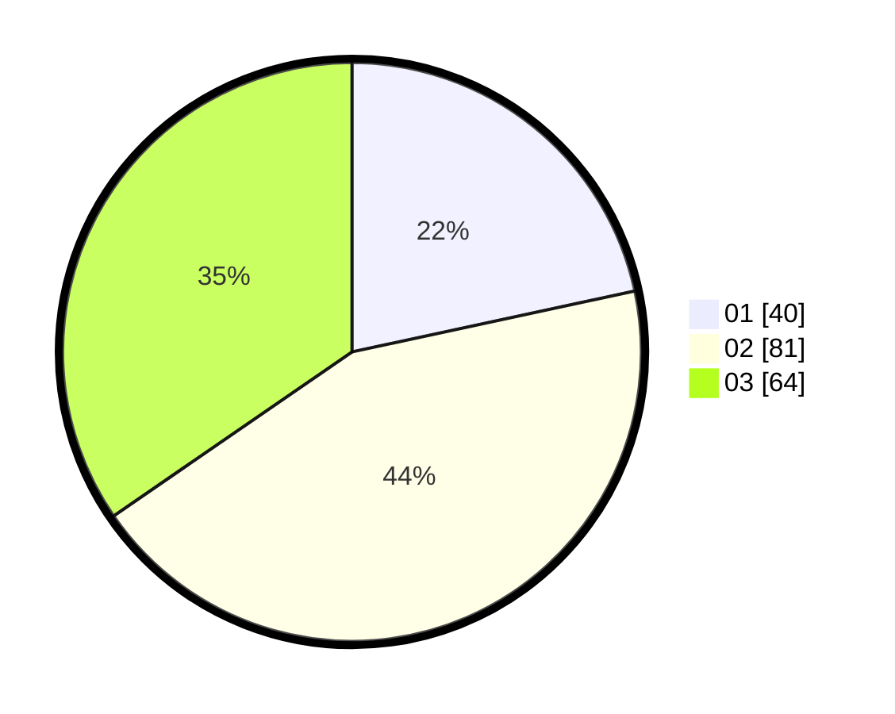

# Hasil

Hasil perolehan suara paslon dapat dilihat pada file paslon-01.txt, paslon-02.txt, dan paslon-03.txt.

Jika tidak ada, artinya data tersebut belum ada pada SIREKAP.

## Perolehan Suara

 * Paslon 01: **40**.
 * Paslon 02: **81**.
 * Paslon 03: **64**.

## Foto C Plano

https://sirekap-obj-formc.kpu.go.id/8baa/pemilu/ppwp/31/73/03/10/04/3173031004021-20240217-192854--531542fd-3359-4cc8-8829-50f8b22da63f.jpg

https://sirekap-obj-formc.kpu.go.id/8baa/pemilu/ppwp/31/73/03/10/04/3173031004021-20240217-192855--f5359513-8fa5-4b97-a80f-be1e8d476280.jpg

https://sirekap-obj-formc.kpu.go.id/8baa/pemilu/ppwp/31/73/03/10/04/3173031004021-20240217-192854--7f7e2ffb-fd38-40e6-833f-cc3538e25029.jpg

## DATA PEMILIH TETAP

Jumlah pemilih dalam DPT: **260**.
 * L: **126**.
 * P: **134**.

## DATA PENGGUNA HAK PILIH

Jumlah pengguna hak pilih dalam DPT: **193**.
 * L: **92**.
 * P: **101**.

Jumlah pengguna hak pilih dalam DPTb: **2**.
 * L: **0**.
 * P: **2**.

Jumlah pengguna hak pilih dalam DPK: **1**.
 * L: **1**.
 * P: **0**.

Jumlah pengguna hak pilih: **196**.
 * L: **93**.
 * P: **103**.

## JUMLAH SUARA SAH DAN TIDAK SAH

JUMLAH SELURUH SUARA SAH: **0**.

JUMLAH SUARA TIDAK SAH: **0**.

JUMLAH SELURUH SUARA SAH DAN SUARA TIDAK SAH: **0**.
