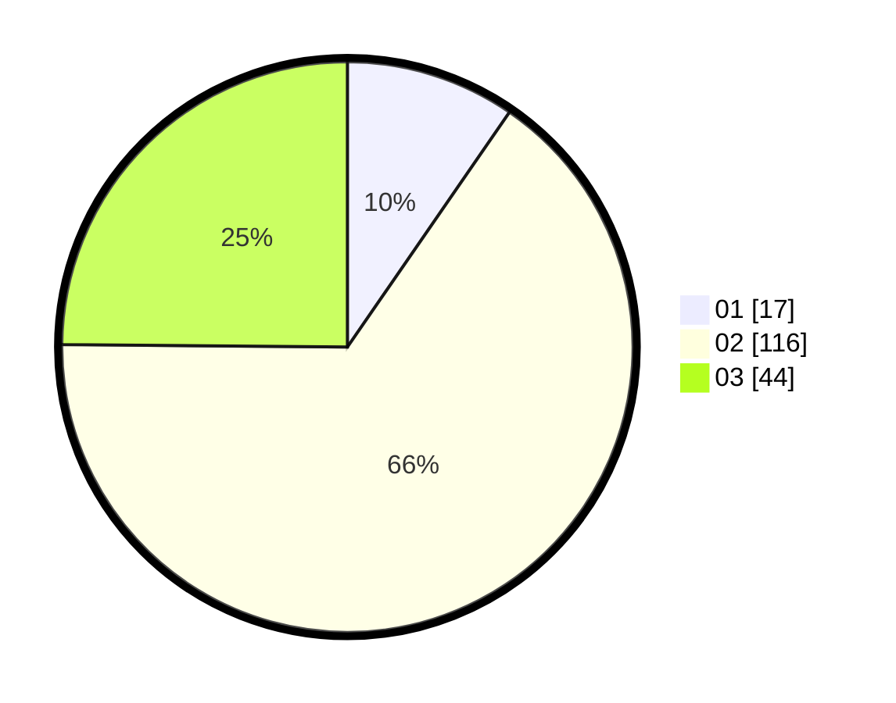

# Hasil

Hasil perolehan suara paslon dapat dilihat pada file paslon-01.txt, paslon-02.txt, dan paslon-03.txt.

Jika tidak ada, artinya data tersebut belum ada pada SIREKAP.

## Perolehan Suara

 * Paslon 01: **17**.
 * Paslon 02: **116**.
 * Paslon 03: **44**.

## Foto C Plano

https://sirekap-obj-formc.kpu.go.id/6b7b/pemilu/ppwp/31/73/03/10/04/3173031004048-20240216-140419--b2d1bf16-045d-4f6d-9954-d3a5a98d561d.jpg

https://sirekap-obj-formc.kpu.go.id/6b7b/pemilu/ppwp/31/73/03/10/04/3173031004048-20240216-140604--040c4f00-0e14-42de-8117-7abc5700e5a0.jpg

https://sirekap-obj-formc.kpu.go.id/6b7b/pemilu/ppwp/31/73/03/10/04/3173031004048-20240216-141728--9c817cd3-6c7f-4dc1-ba93-fa56f5b7c69c.jpg

## DATA PEMILIH TETAP

Jumlah pemilih dalam DPT: **250**.
 * L: **115**.
 * P: **135**.

## DATA PENGGUNA HAK PILIH

Jumlah pengguna hak pilih dalam DPT: **173**.
 * L: **77**.
 * P: **96**.

Jumlah pengguna hak pilih dalam DPTb: **1**.
 * L: **1**.
 * P: **0**.

Jumlah pengguna hak pilih dalam DPK: **3**.
 * L: **1**.
 * P: **2**.

Jumlah pengguna hak pilih: **177**.
 * L: **79**.
 * P: **98**.

## JUMLAH SUARA SAH DAN TIDAK SAH

JUMLAH SELURUH SUARA SAH: **177**.

JUMLAH SUARA TIDAK SAH: **0**.

JUMLAH SELURUH SUARA SAH DAN SUARA TIDAK SAH: **177**.
