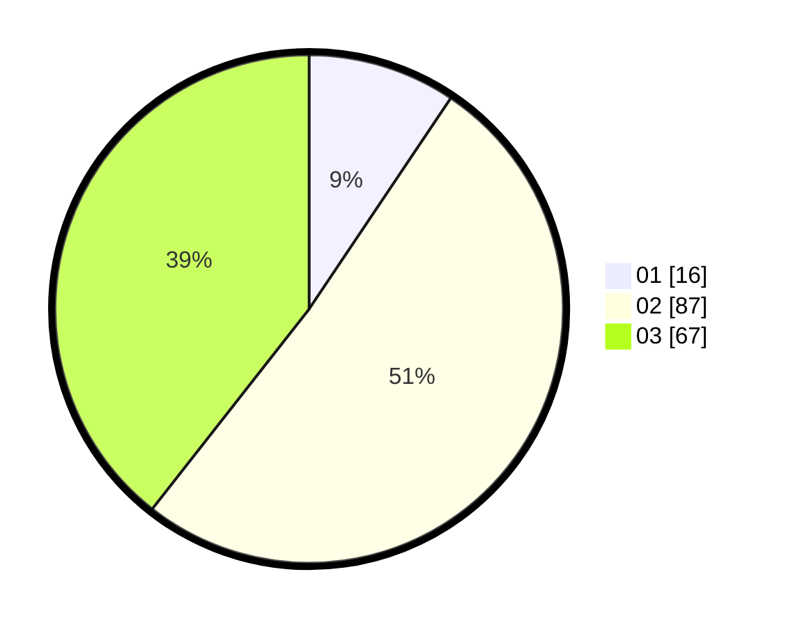

# Hasil

Hasil perolehan suara paslon dapat dilihat pada file paslon-01.txt, paslon-02.txt, dan paslon-03.txt.

Jika tidak ada, artinya data tersebut belum ada pada SIREKAP.

## Perolehan Suara

 * Paslon 01: **16**.
 * Paslon 02: **87**.
 * Paslon 03: **67**.

## Foto C Plano

https://sirekap-obj-formc.kpu.go.id/822b/pemilu/ppwp/31/73/03/10/05/3173031005002-20240214-194257--27754913-6bc6-4511-b169-548a25ecfe8e.jpg

https://sirekap-obj-formc.kpu.go.id/822b/pemilu/ppwp/31/73/03/10/05/3173031005002-20240214-194314--c22b07dc-7081-4c35-8ba7-4316f8246b33.jpg

https://sirekap-obj-formc.kpu.go.id/822b/pemilu/ppwp/31/73/03/10/05/3173031005002-20240214-200919--89524611-9044-431e-9f28-0c07c06ff709.jpg

## DATA PEMILIH TETAP

Jumlah pemilih dalam DPT: **229**.
 * L: **108**.
 * P: **121**.

## DATA PENGGUNA HAK PILIH

Jumlah pengguna hak pilih dalam DPT: **172**.
 * L: **78**.
 * P: **94**.

Jumlah pengguna hak pilih dalam DPTb: **0**.
 * L: **0**.
 * P: **0**.

Jumlah pengguna hak pilih dalam DPK: **0**.
 * L: **0**.
 * P: **0**.

Jumlah pengguna hak pilih: **172**.
 * L: **78**.
 * P: **94**.

## JUMLAH SUARA SAH DAN TIDAK SAH

JUMLAH SELURUH SUARA SAH: **170**.

JUMLAH SUARA TIDAK SAH: **2**.

JUMLAH SELURUH SUARA SAH DAN SUARA TIDAK SAH: **172**.
