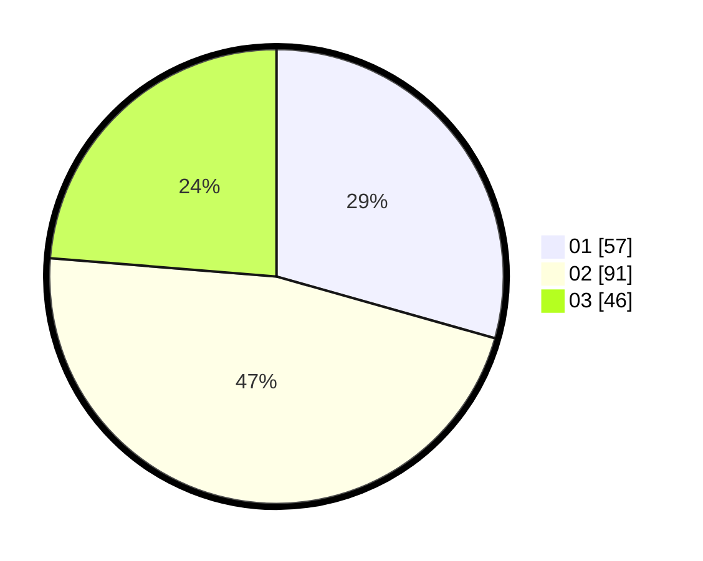

# Hasil

Hasil perolehan suara paslon dapat dilihat pada file paslon-01.txt, paslon-02.txt, dan paslon-03.txt.

Jika tidak ada, artinya data tersebut belum ada pada SIREKAP.

## Perolehan Suara

 * Paslon 01: **57**.
 * Paslon 02: **91**.
 * Paslon 03: **46**.

## Foto C Plano

https://sirekap-obj-formc.kpu.go.id/e701/pemilu/ppwp/31/73/03/10/05/3173031005004-20240215-083337--0dfb5b98-eda2-41b8-b0df-fa7a8f041989.jpg

https://sirekap-obj-formc.kpu.go.id/e701/pemilu/ppwp/31/73/03/10/05/3173031005004-20240215-083358--4a75e9f5-8144-4d22-813a-6ae21497c406.jpg

https://sirekap-obj-formc.kpu.go.id/e701/pemilu/ppwp/31/73/03/10/05/3173031005004-20240215-083347--6b9eff43-92e8-48be-94aa-76d6a92513c5.jpg

## DATA PEMILIH TETAP

Jumlah pemilih dalam DPT: **228**.
 * L: **120**.
 * P: **108**.

## DATA PENGGUNA HAK PILIH

Jumlah pengguna hak pilih dalam DPT: **192**.
 * L: **97**.
 * P: **95**.

Jumlah pengguna hak pilih dalam DPTb: **0**.
 * L: **0**.
 * P: **0**.

Jumlah pengguna hak pilih dalam DPK: **5**.
 * L: **2**.
 * P: **3**.

Jumlah pengguna hak pilih: **197**.
 * L: **99**.
 * P: **98**.

## JUMLAH SUARA SAH DAN TIDAK SAH

JUMLAH SELURUH SUARA SAH: **194**.

JUMLAH SUARA TIDAK SAH: **3**.

JUMLAH SELURUH SUARA SAH DAN SUARA TIDAK SAH: **197**.
