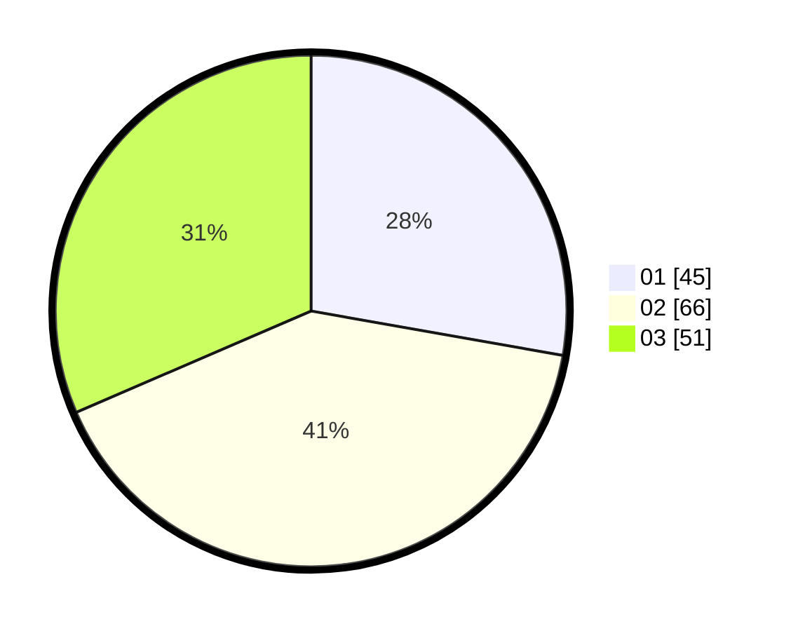

# Hasil

Hasil perolehan suara paslon dapat dilihat pada file paslon-01.txt, paslon-02.txt, dan paslon-03.txt.

Jika tidak ada, artinya data tersebut belum ada pada SIREKAP.

## Perolehan Suara

 * Paslon 01: **45**.
 * Paslon 02: **66**.
 * Paslon 03: **51**.

## Foto C Plano

https://sirekap-obj-formc.kpu.go.id/a545/pemilu/ppwp/31/73/03/10/05/3173031005005-20240214-211525--3133252d-4881-414e-bb53-2234c97ba17f.jpg

https://sirekap-obj-formc.kpu.go.id/a545/pemilu/ppwp/31/73/03/10/05/3173031005005-20240214-214653--11c016de-512d-412b-95a2-c50b5557f4dc.jpg

https://sirekap-obj-formc.kpu.go.id/a545/pemilu/ppwp/31/73/03/10/05/3173031005005-20240214-212438--68c14591-360b-4725-9bae-9ed87e692b1e.jpg
