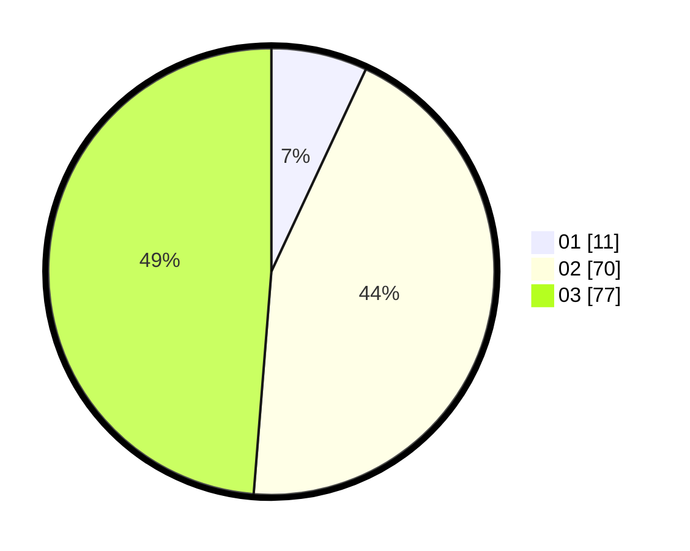

# Hasil

Hasil perolehan suara paslon dapat dilihat pada file paslon-01.txt, paslon-02.txt, dan paslon-03.txt.

Jika tidak ada, artinya data tersebut belum ada pada SIREKAP.

## Perolehan Suara

 * Paslon 01: **11**.
 * Paslon 02: **70**.
 * Paslon 03: **77**.

## Foto C Plano

https://sirekap-obj-formc.kpu.go.id/f7d7/pemilu/ppwp/31/73/03/10/05/3173031005006-20240214-221743--ec69e9b5-f22c-4005-b0cc-67c02b804d04.jpg

https://sirekap-obj-formc.kpu.go.id/f7d7/pemilu/ppwp/31/73/03/10/05/3173031005006-20240214-222121--2085ed11-bad9-4275-a638-94ed669d6bc6.jpg
