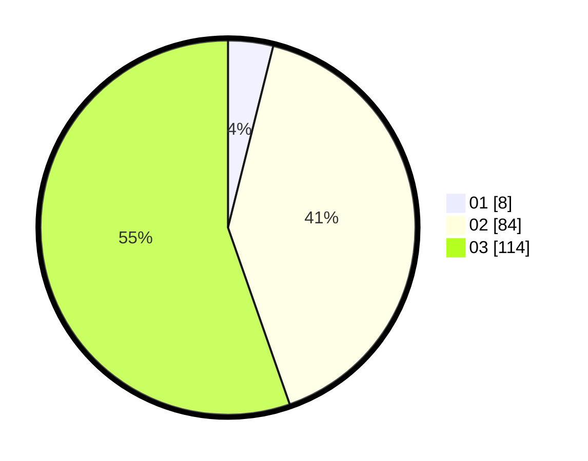

# Hasil

Hasil perolehan suara paslon dapat dilihat pada file paslon-01.txt, paslon-02.txt, dan paslon-03.txt.

Jika tidak ada, artinya data tersebut belum ada pada SIREKAP.

## Perolehan Suara

 * Paslon 01: **8**.
 * Paslon 02: **84**.
 * Paslon 03: **114**.

## Foto C Plano

https://sirekap-obj-formc.kpu.go.id/083a/pemilu/ppwp/31/73/03/10/05/3173031005010-20240215-204651--b1e039f1-cae1-4086-8a06-2277ad55281a.jpg

https://sirekap-obj-formc.kpu.go.id/083a/pemilu/ppwp/31/73/03/10/05/3173031005010-20240214-155610--f769beea-85b5-4512-98ca-156325b36394.jpg

https://sirekap-obj-formc.kpu.go.id/083a/pemilu/ppwp/31/73/03/10/05/3173031005010-20240214-193805--3dbd0728-6bce-4f9a-bd8b-5ef05dc468b3.jpg

## DATA PEMILIH TETAP

Jumlah pemilih dalam DPT: **262**.
 * L: **117**.
 * P: **145**.

## DATA PENGGUNA HAK PILIH

Jumlah pengguna hak pilih dalam DPT: **205**.
 * L: **94**.
 * P: **111**.

Jumlah pengguna hak pilih dalam DPTb: **0**.
 * L: **0**.
 * P: **0**.

Jumlah pengguna hak pilih dalam DPK: **0**.
 * L: **0**.
 * P: **2**.

Jumlah pengguna hak pilih: **207**.
 * L: **94**.
 * P: **113**.

## JUMLAH SUARA SAH DAN TIDAK SAH

JUMLAH SELURUH SUARA SAH: **206**.

JUMLAH SUARA TIDAK SAH: **1**.

JUMLAH SELURUH SUARA SAH DAN SUARA TIDAK SAH: **207**.
