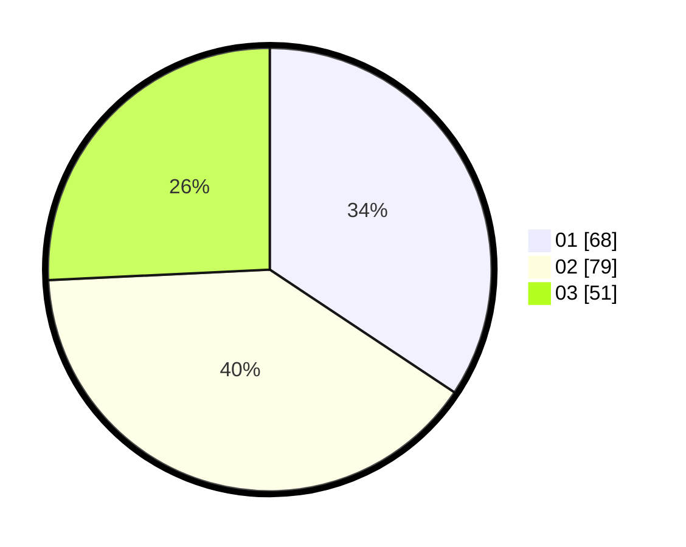

# Hasil

Hasil perolehan suara paslon dapat dilihat pada file paslon-01.txt, paslon-02.txt, dan paslon-03.txt.

Jika tidak ada, artinya data tersebut belum ada pada SIREKAP.

## Perolehan Suara

 * Paslon 01: **68**.
 * Paslon 02: **79**.
 * Paslon 03: **51**.

## Foto C Plano

https://sirekap-obj-formc.kpu.go.id/23ea/pemilu/ppwp/31/73/03/10/05/3173031005016-20240214-211754--d799885e-21c9-4f26-862a-5b87d2391c00.jpg

https://sirekap-obj-formc.kpu.go.id/23ea/pemilu/ppwp/31/73/03/10/05/3173031005016-20240214-211853--79fb2e62-832e-4d2a-9c3a-6a28e0c34efe.jpg

https://sirekap-obj-formc.kpu.go.id/23ea/pemilu/ppwp/31/73/03/10/05/3173031005016-20240214-211933--e5e9722c-568d-464f-8452-ad99eb189074.jpg
