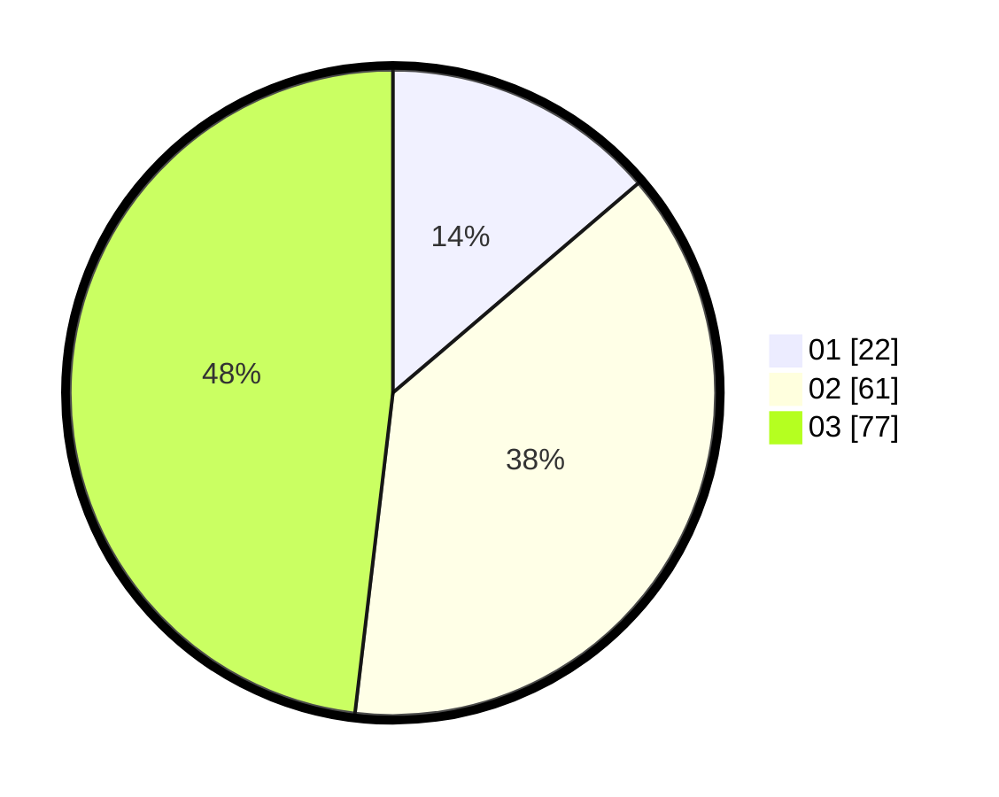

# Hasil

Hasil perolehan suara paslon dapat dilihat pada file paslon-01.txt, paslon-02.txt, dan paslon-03.txt.

Jika tidak ada, artinya data tersebut belum ada pada SIREKAP.

## Perolehan Suara

 * Paslon 01: **22**.
 * Paslon 02: **61**.
 * Paslon 03: **77**.

## Foto C Plano

https://sirekap-obj-formc.kpu.go.id/5d1d/pemilu/ppwp/31/73/03/10/05/3173031005028-20240214-222100--e6c25909-82e5-4156-acdc-431efe4fab10.jpg

https://sirekap-obj-formc.kpu.go.id/5d1d/pemilu/ppwp/31/73/03/10/05/3173031005028-20240214-222246--db58c614-fbc1-4be9-ab8c-9ee0b66e60c9.jpg

https://sirekap-obj-formc.kpu.go.id/5d1d/pemilu/ppwp/31/73/03/10/05/3173031005028-20240214-222440--155244c0-b1aa-4bd9-9e36-593b4bc50ac0.jpg
