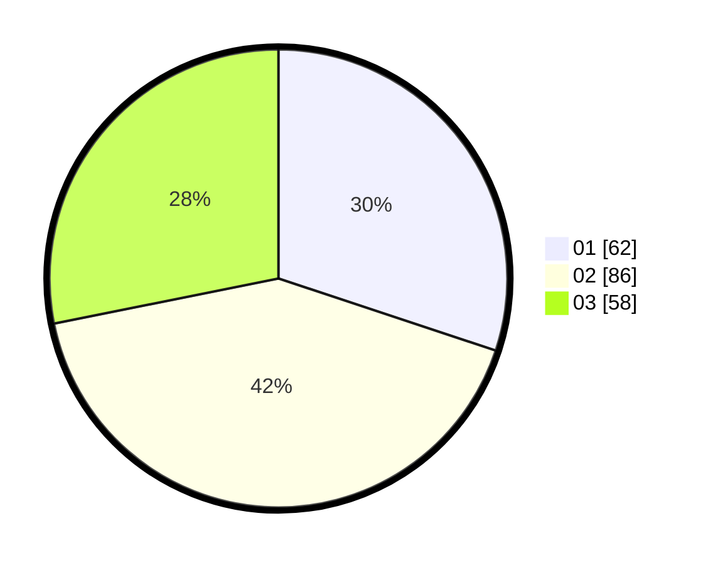

# Hasil

Hasil perolehan suara paslon dapat dilihat pada file paslon-01.txt, paslon-02.txt, dan paslon-03.txt.

Jika tidak ada, artinya data tersebut belum ada pada SIREKAP.

## Perolehan Suara

 * Paslon 01: **62**.
 * Paslon 02: **86**.
 * Paslon 03: **58**.

## Foto C Plano

https://sirekap-obj-formc.kpu.go.id/3512/pemilu/ppwp/31/73/03/10/06/3173031006001-20240214-231505--08fadee0-52ff-4a99-9b66-71acfa087c9d.jpg

https://sirekap-obj-formc.kpu.go.id/3512/pemilu/ppwp/31/73/03/10/06/3173031006001-20240214-231623--ff9cd2de-faa3-4340-bc1f-0a2d0a49e659.jpg

https://sirekap-obj-formc.kpu.go.id/3512/pemilu/ppwp/31/73/03/10/06/3173031006001-20240214-233913--8f4d60e7-9cc4-44f2-a480-441088b387e7.jpg
