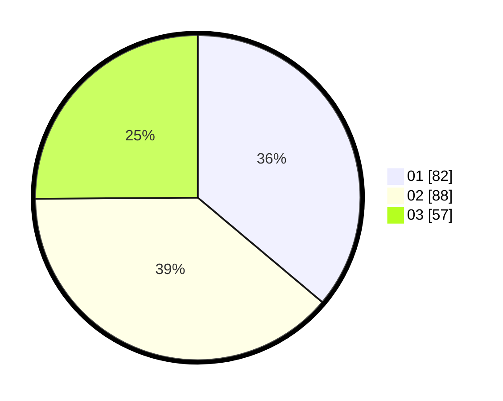

# Hasil

Hasil perolehan suara paslon dapat dilihat pada file paslon-01.txt, paslon-02.txt, dan paslon-03.txt.

Jika tidak ada, artinya data tersebut belum ada pada SIREKAP.

## Perolehan Suara

 * Paslon 01: **82**.
 * Paslon 02: **88**.
 * Paslon 03: **57**.

## Foto C Plano

https://sirekap-obj-formc.kpu.go.id/18b2/pemilu/ppwp/31/73/03/10/06/3173031006003-20240214-184642--834c1398-356c-4fd0-ad52-3e265464dc54.jpg

https://sirekap-obj-formc.kpu.go.id/18b2/pemilu/ppwp/31/73/03/10/06/3173031006003-20240214-184646--4b554f01-3c9b-4bda-8783-219f03445180.jpg

https://sirekap-obj-formc.kpu.go.id/18b2/pemilu/ppwp/31/73/03/10/06/3173031006003-20240214-184651--26722619-1299-493e-93f0-a19419a100f5.jpg

## DATA PEMILIH TETAP

Jumlah pemilih dalam DPT: **277**.
 * L: **133**.
 * P: **144**.

## DATA PENGGUNA HAK PILIH

Jumlah pengguna hak pilih dalam DPT: **224**.
 * L: **110**.
 * P: **114**.

Jumlah pengguna hak pilih dalam DPTb: **1**.
 * L: **1**.
 * P: **0**.

Jumlah pengguna hak pilih dalam DPK: **5**.
 * L: **3**.
 * P: **2**.

Jumlah pengguna hak pilih: **230**.
 * L: **114**.
 * P: **116**.

## JUMLAH SUARA SAH DAN TIDAK SAH

JUMLAH SELURUH SUARA SAH: **227**.

JUMLAH SUARA TIDAK SAH: **3**.

JUMLAH SELURUH SUARA SAH DAN SUARA TIDAK SAH: **230**.
