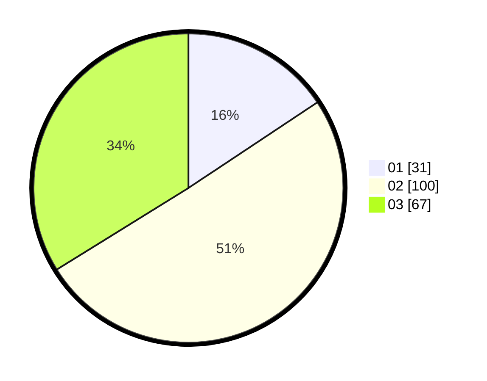

# Hasil

Hasil perolehan suara paslon dapat dilihat pada file paslon-01.txt, paslon-02.txt, dan paslon-03.txt.

Jika tidak ada, artinya data tersebut belum ada pada SIREKAP.

## Perolehan Suara

 * Paslon 01: **31**.
 * Paslon 02: **100**.
 * Paslon 03: **67**.

## Foto C Plano

https://sirekap-obj-formc.kpu.go.id/28ad/pemilu/ppwp/31/73/03/10/06/3173031006004-20240217-195037--c63e40e0-e352-471a-ba06-1286169b57df.jpg

https://sirekap-obj-formc.kpu.go.id/28ad/pemilu/ppwp/31/73/03/10/06/3173031006004-20240217-195039--e7353cef-0f41-4544-9b24-9437056c2a02.jpg

https://sirekap-obj-formc.kpu.go.id/28ad/pemilu/ppwp/31/73/03/10/06/3173031006004-20240217-195038--4da5eb47-c6de-4b3f-8cbf-bfb285dd4e46.jpg

## DATA PEMILIH TETAP

Jumlah pemilih dalam DPT: **253**.
 * L: **127**.
 * P: **126**.

## DATA PENGGUNA HAK PILIH

Jumlah pengguna hak pilih dalam DPT: **196**.
 * L: **93**.
 * P: **103**.

Jumlah pengguna hak pilih dalam DPTb: **0**.
 * L: **0**.
 * P: **0**.

Jumlah pengguna hak pilih dalam DPK: **4**.
 * L: **4**.
 * P: **0**.

Jumlah pengguna hak pilih: **200**.
 * L: **97**.
 * P: **103**.

## JUMLAH SUARA SAH DAN TIDAK SAH

JUMLAH SELURUH SUARA SAH: **198**.

JUMLAH SUARA TIDAK SAH: **2**.

JUMLAH SELURUH SUARA SAH DAN SUARA TIDAK SAH: **200**.
