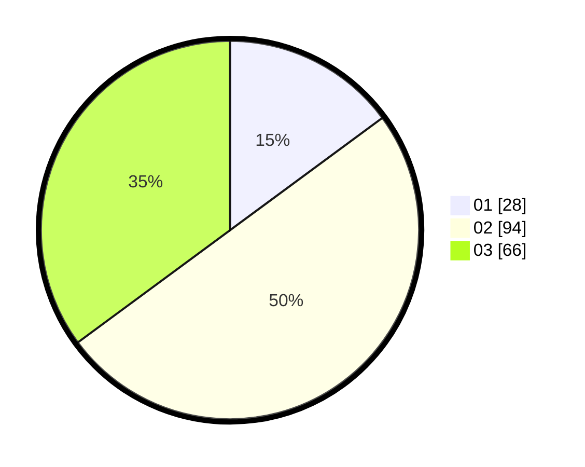

# Hasil

Hasil perolehan suara paslon dapat dilihat pada file paslon-01.txt, paslon-02.txt, dan paslon-03.txt.

Jika tidak ada, artinya data tersebut belum ada pada SIREKAP.

## Perolehan Suara

 * Paslon 01: **28**.
 * Paslon 02: **94**.
 * Paslon 03: **66**.

## Foto C Plano

https://sirekap-obj-formc.kpu.go.id/98b4/pemilu/ppwp/31/73/03/10/06/3173031006005-20240214-223350--db30f953-d66d-49fa-aaab-2da43ba07fa3.jpg

https://sirekap-obj-formc.kpu.go.id/98b4/pemilu/ppwp/31/73/03/10/06/3173031006005-20240214-222521--b66fc9d5-fd86-4b92-a678-6772d23dc8e8.jpg

https://sirekap-obj-formc.kpu.go.id/98b4/pemilu/ppwp/31/73/03/10/06/3173031006005-20240214-223312--2d3b21ac-01d6-4bf8-b5cc-58352fbb883a.jpg
