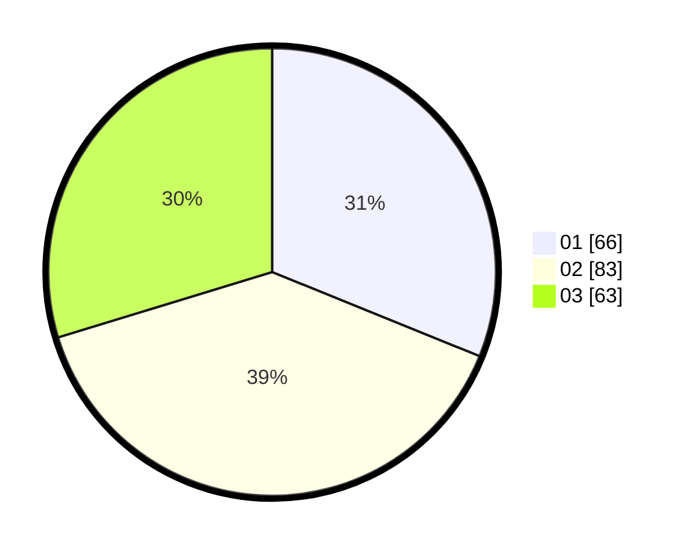

# Hasil

Hasil perolehan suara paslon dapat dilihat pada file paslon-01.txt, paslon-02.txt, dan paslon-03.txt.

Jika tidak ada, artinya data tersebut belum ada pada SIREKAP.

## Perolehan Suara

 * Paslon 01: **66**.
 * Paslon 02: **83**.
 * Paslon 03: **63**.

## Foto C Plano

https://sirekap-obj-formc.kpu.go.id/1a04/pemilu/ppwp/31/73/03/10/06/3173031006007-20240214-211350--9287c27b-273b-4a7b-b519-2e06597b9b70.jpg

https://sirekap-obj-formc.kpu.go.id/1a04/pemilu/ppwp/31/73/03/10/06/3173031006007-20240214-212356--ebb11c8f-37cf-4434-8bed-7a8847cbd2a8.jpg

https://sirekap-obj-formc.kpu.go.id/1a04/pemilu/ppwp/31/73/03/10/06/3173031006007-20240214-212511--7c70c0a6-ecc0-49ab-b7ea-16a6343454b5.jpg
