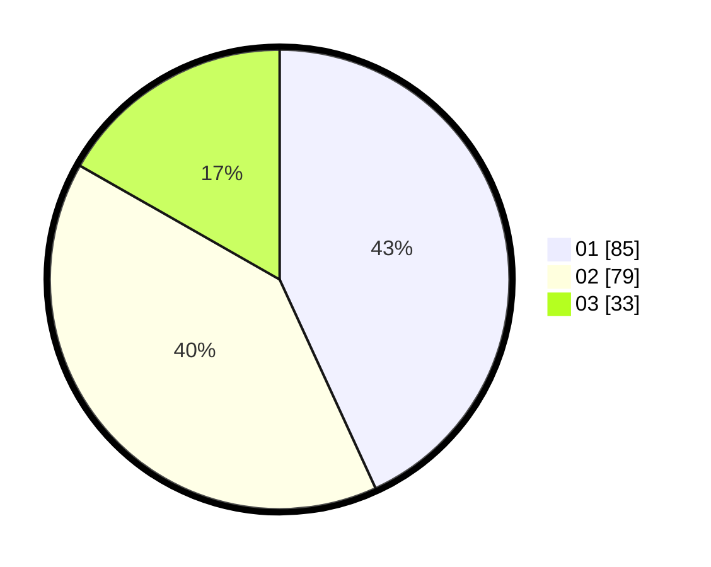

# Hasil

Hasil perolehan suara paslon dapat dilihat pada file paslon-01.txt, paslon-02.txt, dan paslon-03.txt.

Jika tidak ada, artinya data tersebut belum ada pada SIREKAP.

## Perolehan Suara

 * Paslon 01: **85**.
 * Paslon 02: **79**.
 * Paslon 03: **33**.

## Foto C Plano

https://sirekap-obj-formc.kpu.go.id/8979/pemilu/ppwp/31/73/03/10/06/3173031006009-20240215-115704--f3849a1f-90e7-44bd-8876-a2414c5ef759.jpg

https://sirekap-obj-formc.kpu.go.id/8979/pemilu/ppwp/31/73/03/10/06/3173031006009-20240214-211519--854c8f69-c30e-4866-a8d5-c526f53f5a65.jpg
