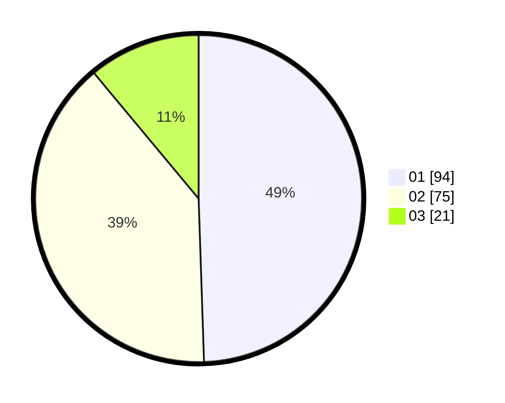

# Hasil

Hasil perolehan suara paslon dapat dilihat pada file paslon-01.txt, paslon-02.txt, dan paslon-03.txt.

Jika tidak ada, artinya data tersebut belum ada pada SIREKAP.

## Perolehan Suara

 * Paslon 01: **94**.
 * Paslon 02: **75**.
 * Paslon 03: **21**.

## Foto C Plano

https://sirekap-obj-formc.kpu.go.id/79c9/pemilu/ppwp/31/73/03/10/06/3173031006021-20240214-215046--797aae7c-fce9-4ff8-8673-0b1801745d70.jpg

https://sirekap-obj-formc.kpu.go.id/79c9/pemilu/ppwp/31/73/03/10/06/3173031006021-20240214-215215--94e777de-094b-4250-8e17-d295c78ce49a.jpg

https://sirekap-obj-formc.kpu.go.id/79c9/pemilu/ppwp/31/73/03/10/06/3173031006021-20240214-215437--7577a875-67a7-431e-a281-f62048b94ae1.jpg
