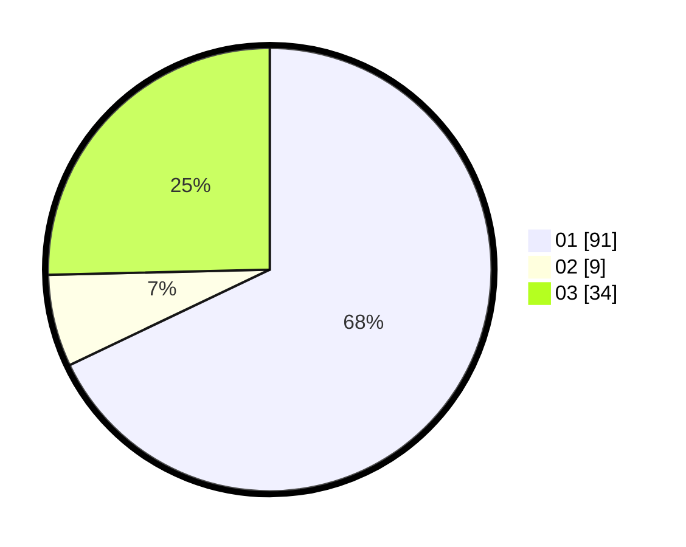

# Hasil

Hasil perolehan suara paslon dapat dilihat pada file paslon-01.txt, paslon-02.txt, dan paslon-03.txt.

Jika tidak ada, artinya data tersebut belum ada pada SIREKAP.

## Perolehan Suara

 * Paslon 01: **91**.
 * Paslon 02: **9**.
 * Paslon 03: **34**.

## Foto C Plano

https://sirekap-obj-formc.kpu.go.id/385e/pemilu/ppwp/31/73/03/10/06/3173031006031-20240215-002937--6fde3501-4b5b-4dd5-a7cd-54c5493e5524.jpg

https://sirekap-obj-formc.kpu.go.id/385e/pemilu/ppwp/31/73/03/10/06/3173031006031-20240215-002953--3c14d3c9-b1ab-4bd7-b914-b3de7566dbd0.jpg

https://sirekap-obj-formc.kpu.go.id/385e/pemilu/ppwp/31/73/03/10/06/3173031006031-20240215-003008--5d6f7eaa-8405-4a0e-b160-43ee7afcf883.jpg
