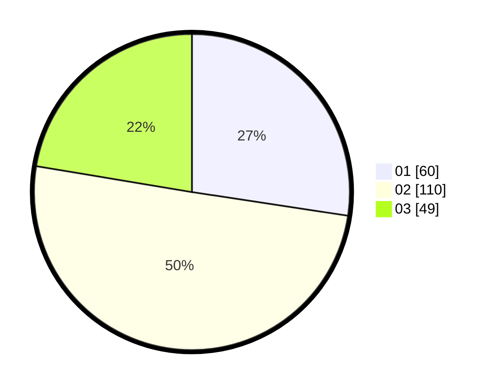

# Hasil

Hasil perolehan suara paslon dapat dilihat pada file paslon-01.txt, paslon-02.txt, dan paslon-03.txt.

Jika tidak ada, artinya data tersebut belum ada pada SIREKAP.

## Perolehan Suara

 * Paslon 01: **60**.
 * Paslon 02: **110**.
 * Paslon 03: **49**.

## Foto C Plano

https://sirekap-obj-formc.kpu.go.id/7603/pemilu/ppwp/31/73/03/10/06/3173031006034-20240214-212733--434eec55-329f-4497-a2f4-34aba1452d6f.jpg

https://sirekap-obj-formc.kpu.go.id/7603/pemilu/ppwp/31/73/03/10/06/3173031006034-20240214-213257--6e890662-53ac-4101-8f5d-0783387bea0e.jpg

https://sirekap-obj-formc.kpu.go.id/7603/pemilu/ppwp/31/73/03/10/06/3173031006034-20240215-010137--6fccc126-5561-4080-8d77-0ced6a0c851b.jpg
