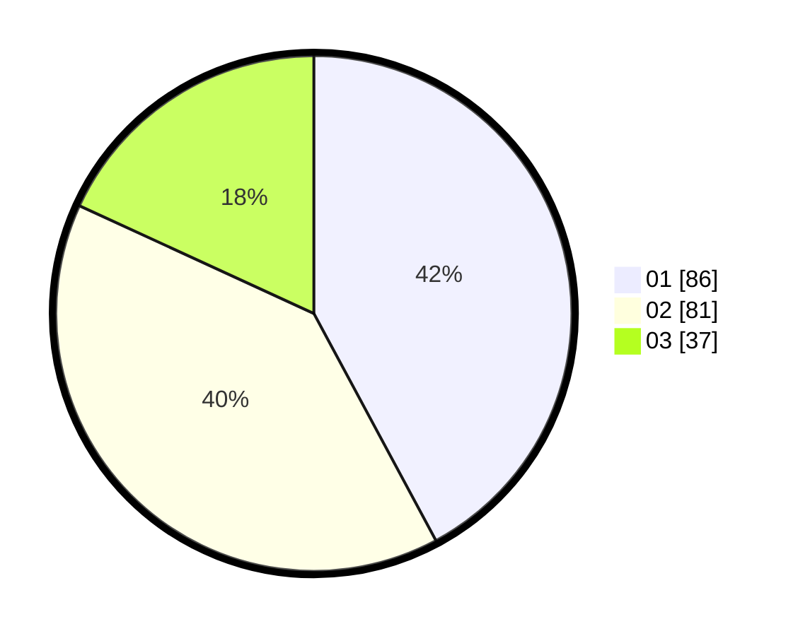

# Hasil

Hasil perolehan suara paslon dapat dilihat pada file paslon-01.txt, paslon-02.txt, dan paslon-03.txt.

Jika tidak ada, artinya data tersebut belum ada pada SIREKAP.

## Perolehan Suara

 * Paslon 01: **86**.
 * Paslon 02: **81**.
 * Paslon 03: **37**.

## Foto C Plano

https://sirekap-obj-formc.kpu.go.id/fb57/pemilu/ppwp/31/73/03/10/06/3173031006035-20240215-012241--aea07f4a-a764-4356-a844-c250f14a090f.jpg

https://sirekap-obj-formc.kpu.go.id/fb57/pemilu/ppwp/31/73/03/10/06/3173031006035-20240215-012421--df4e004a-bc42-4996-84bf-760cb6d9725d.jpg

https://sirekap-obj-formc.kpu.go.id/fb57/pemilu/ppwp/31/73/03/10/06/3173031006035-20240215-012553--3956a74c-d40c-4ed6-b4b3-de0f7435f321.jpg
