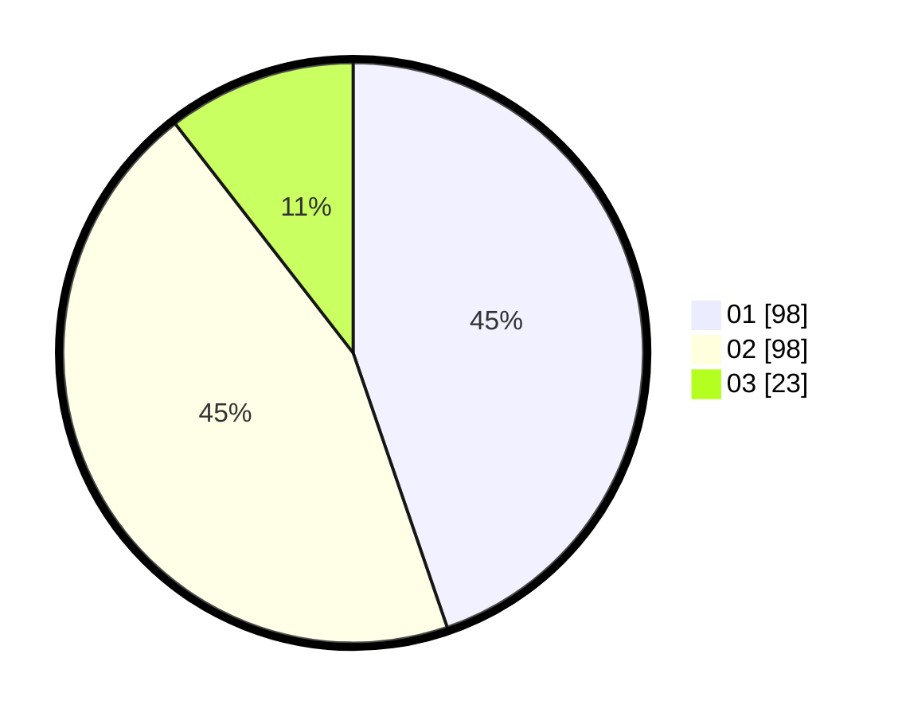

# Hasil

Hasil perolehan suara paslon dapat dilihat pada file paslon-01.txt, paslon-02.txt, dan paslon-03.txt.

Jika tidak ada, artinya data tersebut belum ada pada SIREKAP.

## Perolehan Suara

 * Paslon 01: **98**.
 * Paslon 02: **98**.
 * Paslon 03: **23**.

## Foto C Plano

https://sirekap-obj-formc.kpu.go.id/3e04/pemilu/ppwp/31/73/03/10/06/3173031006036-20240214-213724--e684b2b6-b9c2-46a3-ada1-30fc788bf261.jpg

https://sirekap-obj-formc.kpu.go.id/3e04/pemilu/ppwp/31/73/03/10/06/3173031006036-20240214-203848--7c2a7892-ab3b-4283-ab68-4b096cca8235.jpg

https://sirekap-obj-formc.kpu.go.id/3e04/pemilu/ppwp/31/73/03/10/06/3173031006036-20240214-203802--4df21e3e-b62a-4672-9c72-ee8bb6712102.jpg
