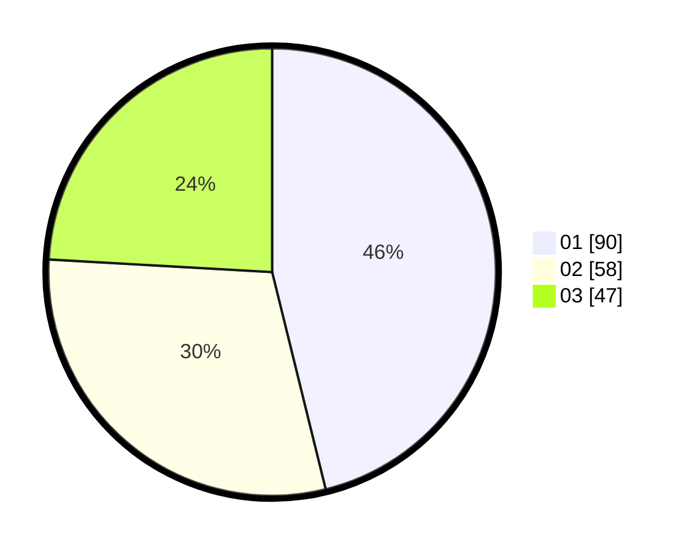

# Hasil

Hasil perolehan suara paslon dapat dilihat pada file paslon-01.txt, paslon-02.txt, dan paslon-03.txt.

Jika tidak ada, artinya data tersebut belum ada pada SIREKAP.

## Perolehan Suara

 * Paslon 01: **90**.
 * Paslon 02: **58**.
 * Paslon 03: **47**.

## Foto C Plano

https://sirekap-obj-formc.kpu.go.id/0cd4/pemilu/ppwp/31/73/03/10/06/3173031006037-20240214-214151--1b6f5f4b-6f30-487c-b2dc-9f4d283422d3.jpg

https://sirekap-obj-formc.kpu.go.id/0cd4/pemilu/ppwp/31/73/03/10/06/3173031006037-20240214-214250--09ec6461-4d87-416d-92f6-d8fe51671739.jpg

https://sirekap-obj-formc.kpu.go.id/0cd4/pemilu/ppwp/31/73/03/10/06/3173031006037-20240214-214315--3d0e8a32-df3e-4fda-ade9-6dad452c0281.jpg
