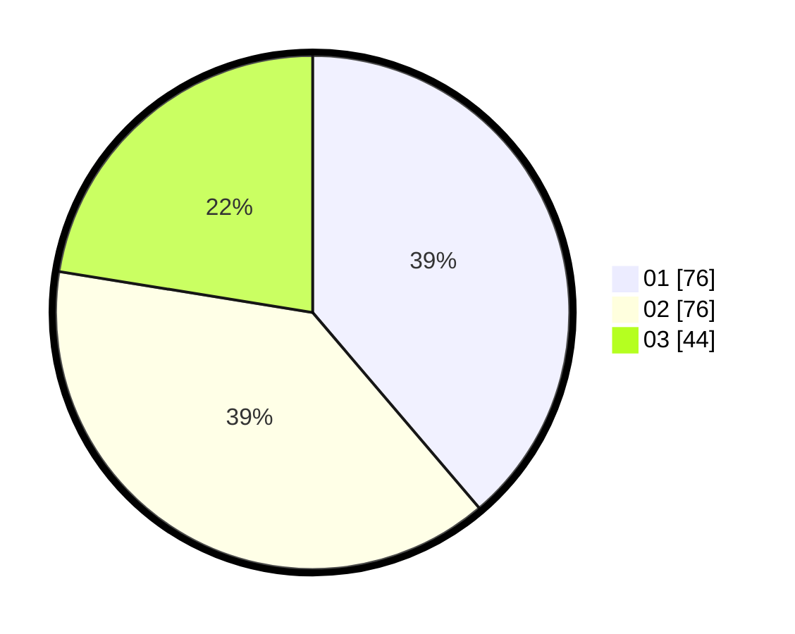

# Hasil

Hasil perolehan suara paslon dapat dilihat pada file paslon-01.txt, paslon-02.txt, dan paslon-03.txt.

Jika tidak ada, artinya data tersebut belum ada pada SIREKAP.

## Perolehan Suara

 * Paslon 01: **76**.
 * Paslon 02: **76**.
 * Paslon 03: **44**.

## Foto C Plano

https://sirekap-obj-formc.kpu.go.id/eb79/pemilu/ppwp/31/73/03/10/06/3173031006041-20240214-185613--e0032ec4-b93f-4c60-816b-6bfbf337c4d6.jpg

https://sirekap-obj-formc.kpu.go.id/eb79/pemilu/ppwp/31/73/03/10/06/3173031006041-20240214-192143--53882294-8579-42bb-b405-5cdb2e346144.jpg

https://sirekap-obj-formc.kpu.go.id/eb79/pemilu/ppwp/31/73/03/10/06/3173031006041-20240214-191526--b7217db3-0414-475b-a67b-865858a870a4.jpg

## DATA PEMILIH TETAP

Jumlah pemilih dalam DPT: **280**.
 * L: **141**.
 * P: **139**.

## DATA PENGGUNA HAK PILIH

Jumlah pengguna hak pilih dalam DPT: **194**.
 * L: **103**.
 * P: **91**.

Jumlah pengguna hak pilih dalam DPTb: **3**.
 * L: **3**.
 * P: **0**.

Jumlah pengguna hak pilih dalam DPK: **2**.
 * L: **1**.
 * P: **1**.

Jumlah pengguna hak pilih: **199**.
 * L: **107**.
 * P: **92**.

## JUMLAH SUARA SAH DAN TIDAK SAH

JUMLAH SELURUH SUARA SAH: **196**.

JUMLAH SUARA TIDAK SAH: **3**.

JUMLAH SELURUH SUARA SAH DAN SUARA TIDAK SAH: **199**.
