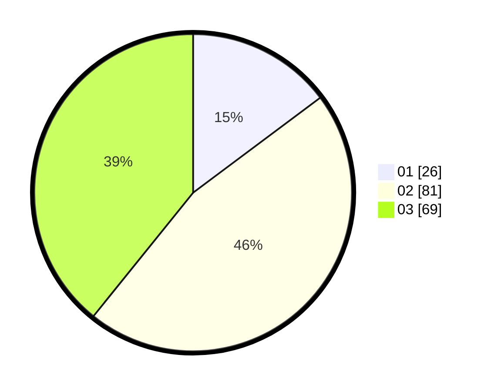

# Hasil

Hasil perolehan suara paslon dapat dilihat pada file paslon-01.txt, paslon-02.txt, dan paslon-03.txt.

Jika tidak ada, artinya data tersebut belum ada pada SIREKAP.

## Perolehan Suara

 * Paslon 01: **26**.
 * Paslon 02: **81**.
 * Paslon 03: **69**.

## Foto C Plano

https://sirekap-obj-formc.kpu.go.id/3c21/pemilu/ppwp/31/73/03/10/06/3173031006042-20240214-213451--a90e54ca-2fcc-48b2-ae04-d25e20e1cc60.jpg

https://sirekap-obj-formc.kpu.go.id/3c21/pemilu/ppwp/31/73/03/10/06/3173031006042-20240214-213543--a6c6ad67-be72-4165-9f94-92665fca73d3.jpg

https://sirekap-obj-formc.kpu.go.id/3c21/pemilu/ppwp/31/73/03/10/06/3173031006042-20240214-203024--9bf70269-03ff-48b6-bebc-a76f5124a295.jpg
