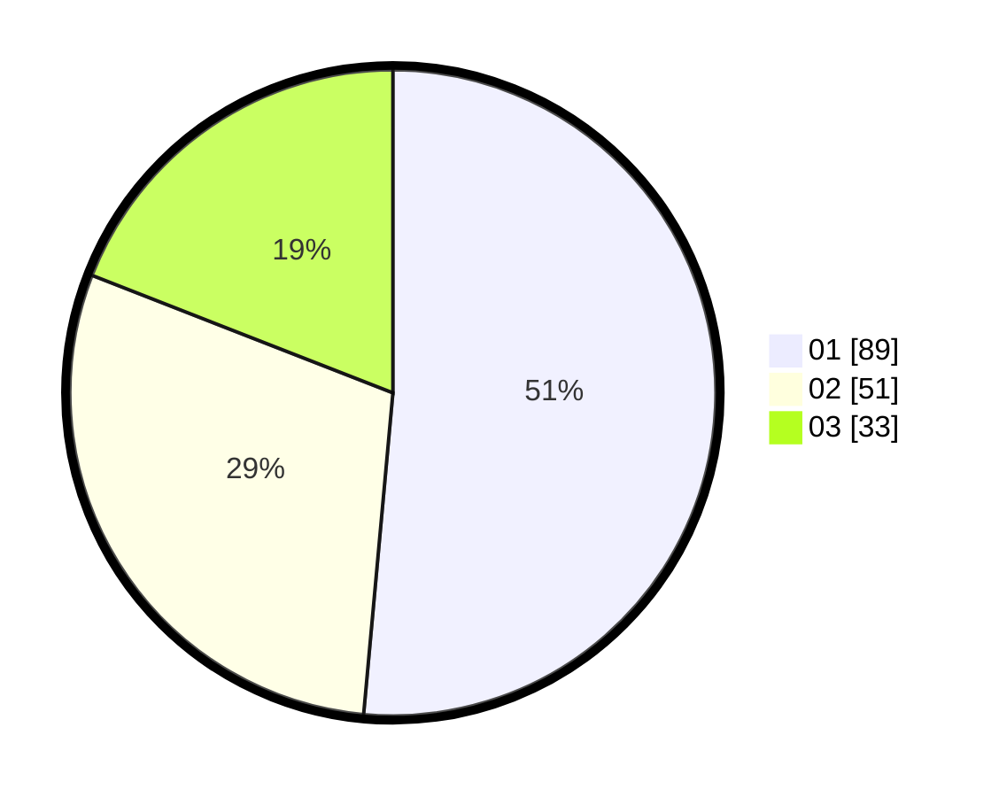

# Hasil

Hasil perolehan suara paslon dapat dilihat pada file paslon-01.txt, paslon-02.txt, dan paslon-03.txt.

Jika tidak ada, artinya data tersebut belum ada pada SIREKAP.

## Perolehan Suara

 * Paslon 01: **89**.
 * Paslon 02: **51**.
 * Paslon 03: **33**.

## Foto C Plano

https://sirekap-obj-formc.kpu.go.id/0b3e/pemilu/ppwp/31/73/03/10/06/3173031006045-20240214-215618--cedc62bf-07f4-4c36-abb5-62b0d8578118.jpg

https://sirekap-obj-formc.kpu.go.id/0b3e/pemilu/ppwp/31/73/03/10/06/3173031006045-20240214-215330--5f852357-4b9a-430a-8b9d-8c460b7d8fd0.jpg

https://sirekap-obj-formc.kpu.go.id/0b3e/pemilu/ppwp/31/73/03/10/06/3173031006045-20240214-215802--c2c069f8-b9b6-4d42-8503-a264495969d0.jpg
