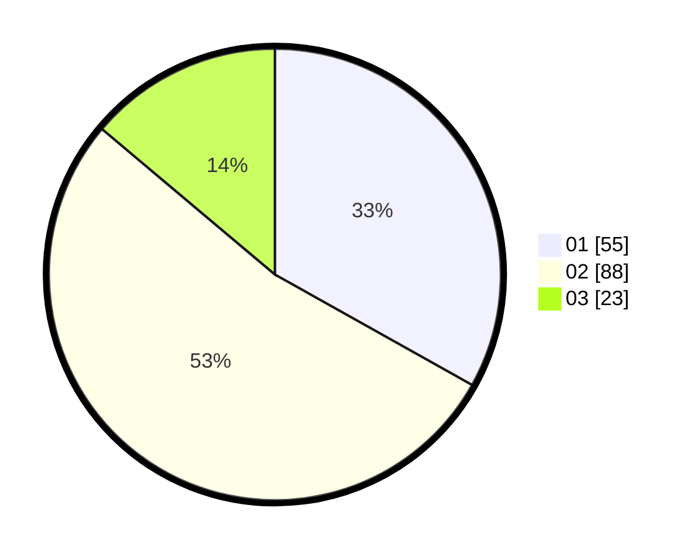

# Hasil

Hasil perolehan suara paslon dapat dilihat pada file paslon-01.txt, paslon-02.txt, dan paslon-03.txt.

Jika tidak ada, artinya data tersebut belum ada pada SIREKAP.

## Perolehan Suara

 * Paslon 01: **55**.
 * Paslon 02: **88**.
 * Paslon 03: **23**.

## Foto C Plano

https://sirekap-obj-formc.kpu.go.id/959d/pemilu/ppwp/31/73/03/10/06/3173031006048-20240214-194041--f60b0fd8-b776-4978-8d70-11d181f8de5a.jpg

https://sirekap-obj-formc.kpu.go.id/959d/pemilu/ppwp/31/73/03/10/06/3173031006048-20240214-194045--57a944c9-05fd-4e79-92a1-32c84184e768.jpg

https://sirekap-obj-formc.kpu.go.id/959d/pemilu/ppwp/31/73/03/10/06/3173031006048-20240214-194053--993f2b01-1474-4a67-ba12-81ad1fe5d1aa.jpg

## DATA PEMILIH TETAP

Jumlah pemilih dalam DPT: **244**.
 * L: **118**.
 * P: **126**.

## DATA PENGGUNA HAK PILIH

Jumlah pengguna hak pilih dalam DPT: **170**.
 * L: **81**.
 * P: **89**.

Jumlah pengguna hak pilih dalam DPTb: **0**.
 * L: **0**.
 * P: **0**.

Jumlah pengguna hak pilih dalam DPK: **5**.
 * L: **1**.
 * P: **4**.

Jumlah pengguna hak pilih: **175**.
 * L: **82**.
 * P: **93**.

## JUMLAH SUARA SAH DAN TIDAK SAH

JUMLAH SELURUH SUARA SAH: **166**.

JUMLAH SUARA TIDAK SAH: **9**.

JUMLAH SELURUH SUARA SAH DAN SUARA TIDAK SAH: **175**.
