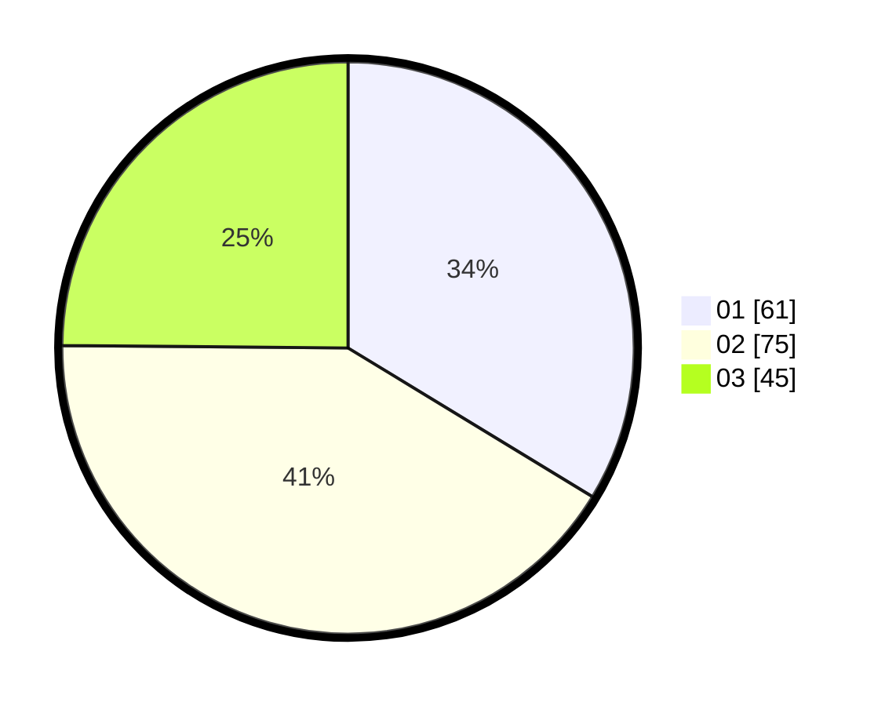

# Hasil

Hasil perolehan suara paslon dapat dilihat pada file paslon-01.txt, paslon-02.txt, dan paslon-03.txt.

Jika tidak ada, artinya data tersebut belum ada pada SIREKAP.

## Perolehan Suara

 * Paslon 01: **61**.
 * Paslon 02: **75**.
 * Paslon 03: **45**.

## Foto C Plano

https://sirekap-obj-formc.kpu.go.id/6434/pemilu/ppwp/31/73/03/10/06/3173031006049-20240214-190429--1cd39dda-af0d-44da-94d7-dcb2161cfad4.jpg

https://sirekap-obj-formc.kpu.go.id/6434/pemilu/ppwp/31/73/03/10/06/3173031006049-20240214-185613--b27159f9-183b-4e49-9521-c0f8ec60ddff.jpg

https://sirekap-obj-formc.kpu.go.id/6434/pemilu/ppwp/31/73/03/10/06/3173031006049-20240214-185906--6e1c6178-e06c-41f0-897e-7dedae4ff206.jpg

## DATA PEMILIH TETAP

Jumlah pemilih dalam DPT: **253**.
 * L: **134**.
 * P: **119**.

## DATA PENGGUNA HAK PILIH

Jumlah pengguna hak pilih dalam DPT: **178**.
 * L: **88**.
 * P: **90**.

Jumlah pengguna hak pilih dalam DPTb: **6**.
 * L: **3**.
 * P: **3**.

Jumlah pengguna hak pilih dalam DPK: **3**.
 * L: **1**.
 * P: **2**.

Jumlah pengguna hak pilih: **187**.
 * L: **92**.
 * P: **95**.

## JUMLAH SUARA SAH DAN TIDAK SAH

JUMLAH SELURUH SUARA SAH: **181**.

JUMLAH SUARA TIDAK SAH: **6**.

JUMLAH SELURUH SUARA SAH DAN SUARA TIDAK SAH: **187**.
