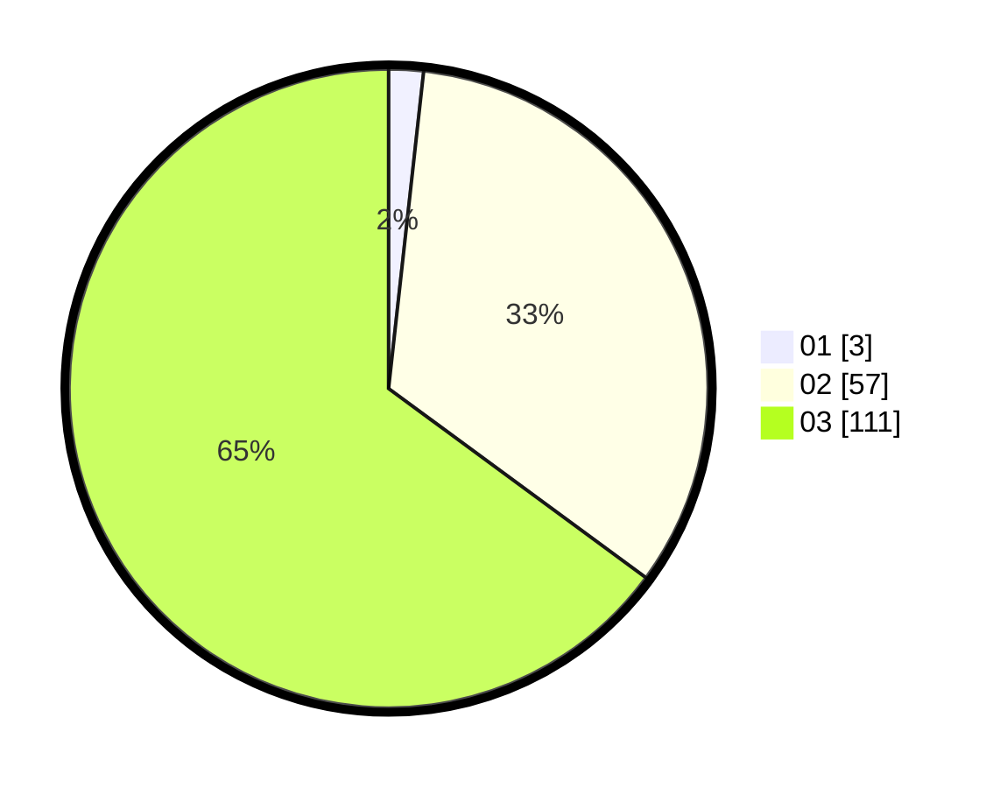

# Hasil

Hasil perolehan suara paslon dapat dilihat pada file paslon-01.txt, paslon-02.txt, dan paslon-03.txt.

Jika tidak ada, artinya data tersebut belum ada pada SIREKAP.

## Perolehan Suara

 * Paslon 01: **3**.
 * Paslon 02: **57**.
 * Paslon 03: **111**.

## Foto C Plano

https://sirekap-obj-formc.kpu.go.id/f42c/pemilu/ppwp/31/73/03/10/07/3173031007015-20240214-224918--7b167331-4c17-4d6b-a62b-c4d727d2cbe7.jpg

https://sirekap-obj-formc.kpu.go.id/f42c/pemilu/ppwp/31/73/03/10/07/3173031007015-20240214-225136--d51cc303-0700-4095-b67d-5b71df1ac561.jpg

https://sirekap-obj-formc.kpu.go.id/f42c/pemilu/ppwp/31/73/03/10/07/3173031007015-20240214-225437--025eaff9-35e2-4f89-a21f-64af535f04f5.jpg
