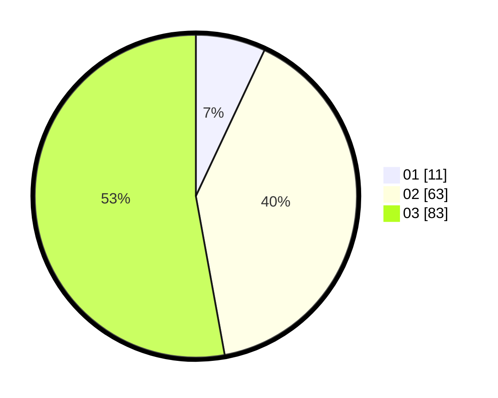

# Hasil

Hasil perolehan suara paslon dapat dilihat pada file paslon-01.txt, paslon-02.txt, dan paslon-03.txt.

Jika tidak ada, artinya data tersebut belum ada pada SIREKAP.

## Perolehan Suara

 * Paslon 01: **11**.
 * Paslon 02: **63**.
 * Paslon 03: **83**.

## Foto C Plano

https://sirekap-obj-formc.kpu.go.id/8898/pemilu/ppwp/31/73/03/10/07/3173031007018-20240214-192554--e56516ab-3fa9-4820-8d42-4ae27c07dd67.jpg

https://sirekap-obj-formc.kpu.go.id/8898/pemilu/ppwp/31/73/03/10/07/3173031007018-20240214-192607--067f94ba-9208-4e83-abfe-19b937079525.jpg

https://sirekap-obj-formc.kpu.go.id/8898/pemilu/ppwp/31/73/03/10/07/3173031007018-20240214-192613--da1b8173-06ed-4d24-b390-ea5cbf36693f.jpg

## DATA PEMILIH TETAP

Jumlah pemilih dalam DPT: **202**.
 * L: **93**.
 * P: **109**.

## DATA PENGGUNA HAK PILIH

Jumlah pengguna hak pilih dalam DPT: **139**.
 * L: **67**.
 * P: **72**.

Jumlah pengguna hak pilih dalam DPTb: **16**.
 * L: **7**.
 * P: **9**.

Jumlah pengguna hak pilih dalam DPK: **3**.
 * L: **1**.
 * P: **2**.

Jumlah pengguna hak pilih: **158**.
 * L: **75**.
 * P: **83**.

## JUMLAH SUARA SAH DAN TIDAK SAH

JUMLAH SELURUH SUARA SAH: **157**.

JUMLAH SUARA TIDAK SAH: **1**.

JUMLAH SELURUH SUARA SAH DAN SUARA TIDAK SAH: **158**.
