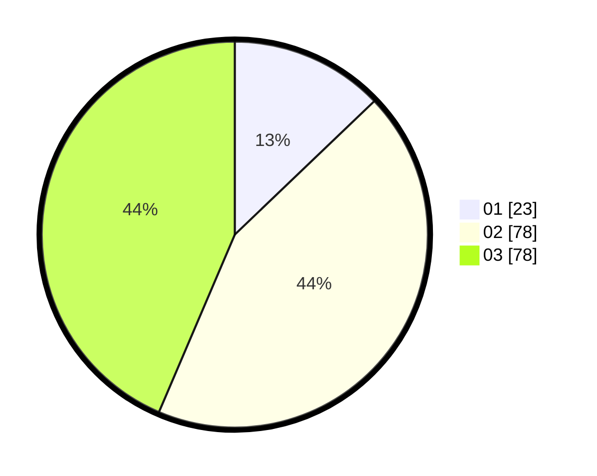

# Hasil

Hasil perolehan suara paslon dapat dilihat pada file paslon-01.txt, paslon-02.txt, dan paslon-03.txt.

Jika tidak ada, artinya data tersebut belum ada pada SIREKAP.

## Perolehan Suara

 * Paslon 01: **23**.
 * Paslon 02: **78**.
 * Paslon 03: **78**.

## Foto C Plano

https://sirekap-obj-formc.kpu.go.id/91fc/pemilu/ppwp/31/73/03/10/07/3173031007020-20240214-200645--5b8abcbb-9e2e-43d9-9883-8ee25d64c9f5.jpg

https://sirekap-obj-formc.kpu.go.id/91fc/pemilu/ppwp/31/73/03/10/07/3173031007020-20240214-200613--78e66189-d6a4-4204-b7e7-c0a8a0425e97.jpg

https://sirekap-obj-formc.kpu.go.id/91fc/pemilu/ppwp/31/73/03/10/07/3173031007020-20240214-200543--1b4afd2f-b7bf-4245-ba6d-3c9390fe345f.jpg

## DATA PEMILIH TETAP

Jumlah pemilih dalam DPT: **254**.
 * L: **123**.
 * P: **131**.

## DATA PENGGUNA HAK PILIH

Jumlah pengguna hak pilih dalam DPT: **181**.
 * L: **86**.
 * P: **95**.

Jumlah pengguna hak pilih dalam DPTb: **5**.
 * L: **3**.
 * P: **2**.

Jumlah pengguna hak pilih dalam DPK: **1**.
 * L: **1**.
 * P: **0**.

Jumlah pengguna hak pilih: **187**.
 * L: **90**.
 * P: **97**.

## JUMLAH SUARA SAH DAN TIDAK SAH

JUMLAH SELURUH SUARA SAH: **179**.

JUMLAH SUARA TIDAK SAH: **8**.

JUMLAH SELURUH SUARA SAH DAN SUARA TIDAK SAH: **187**.
