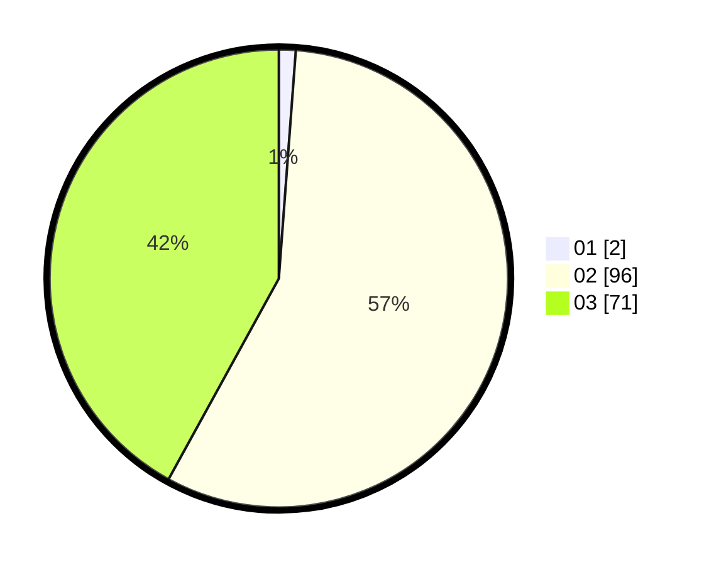

# Hasil

Hasil perolehan suara paslon dapat dilihat pada file paslon-01.txt, paslon-02.txt, dan paslon-03.txt.

Jika tidak ada, artinya data tersebut belum ada pada SIREKAP.

## Perolehan Suara

 * Paslon 01: **2**.
 * Paslon 02: **96**.
 * Paslon 03: **71**.

## Foto C Plano

https://sirekap-obj-formc.kpu.go.id/a625/pemilu/ppwp/31/73/03/10/08/3173031008003-20240215-221041--0dbf3085-a75d-4401-a9db-accf531dc830.jpg

https://sirekap-obj-formc.kpu.go.id/a625/pemilu/ppwp/31/73/03/10/08/3173031008003-20240215-221043--ca1eff2a-410f-4d80-89e0-453819701849.jpg

https://sirekap-obj-formc.kpu.go.id/a625/pemilu/ppwp/31/73/03/10/08/3173031008003-20240215-221042--cdeca68d-c78c-486c-af8b-3892e7fa3c57.jpg

## DATA PEMILIH TETAP

Jumlah pemilih dalam DPT: **247**.
 * L: **136**.
 * P: **111**.

## DATA PENGGUNA HAK PILIH

Jumlah pengguna hak pilih dalam DPT: **168**.
 * L: **89**.
 * P: **79**.

Jumlah pengguna hak pilih dalam DPTb: **0**.
 * L: **0**.
 * P: **0**.

Jumlah pengguna hak pilih dalam DPK: **8**.
 * L: **4**.
 * P: **4**.

Jumlah pengguna hak pilih: **176**.
 * L: **93**.
 * P: **83**.

## JUMLAH SUARA SAH DAN TIDAK SAH

JUMLAH SELURUH SUARA SAH: **169**.

JUMLAH SUARA TIDAK SAH: **7**.

JUMLAH SELURUH SUARA SAH DAN SUARA TIDAK SAH: **176**.
