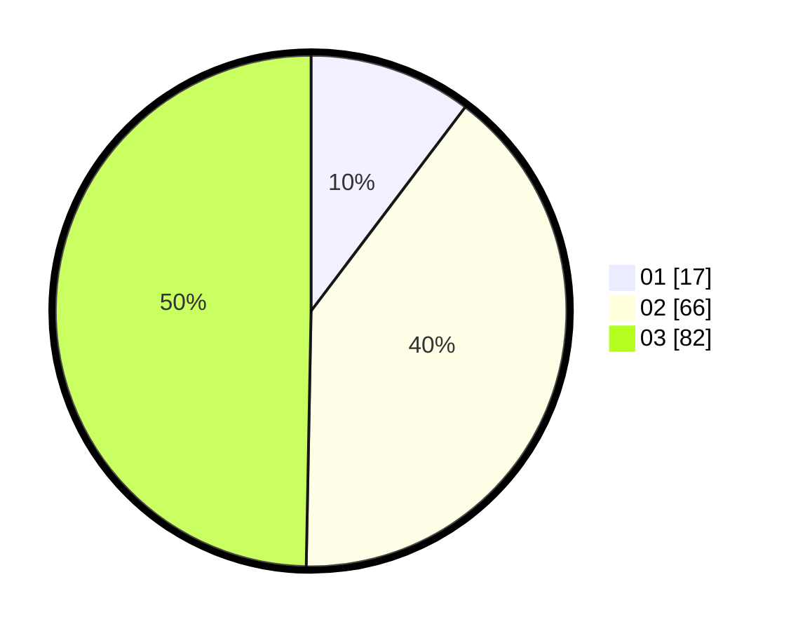

# Hasil

Hasil perolehan suara paslon dapat dilihat pada file paslon-01.txt, paslon-02.txt, dan paslon-03.txt.

Jika tidak ada, artinya data tersebut belum ada pada SIREKAP.

## Perolehan Suara

 * Paslon 01: **17**.
 * Paslon 02: **66**.
 * Paslon 03: **82**.

## Foto C Plano

https://sirekap-obj-formc.kpu.go.id/186b/pemilu/ppwp/31/73/03/10/08/3173031008005-20240214-223120--61b4bcf5-9b79-403b-b07b-ebe130b48000.jpg

https://sirekap-obj-formc.kpu.go.id/186b/pemilu/ppwp/31/73/03/10/08/3173031008005-20240214-223254--4489faa2-ac89-4e7c-946b-136918b44aad.jpg

https://sirekap-obj-formc.kpu.go.id/186b/pemilu/ppwp/31/73/03/10/08/3173031008005-20240214-192806--77959053-e42a-4a93-9783-eebf91c87f7d.jpg
