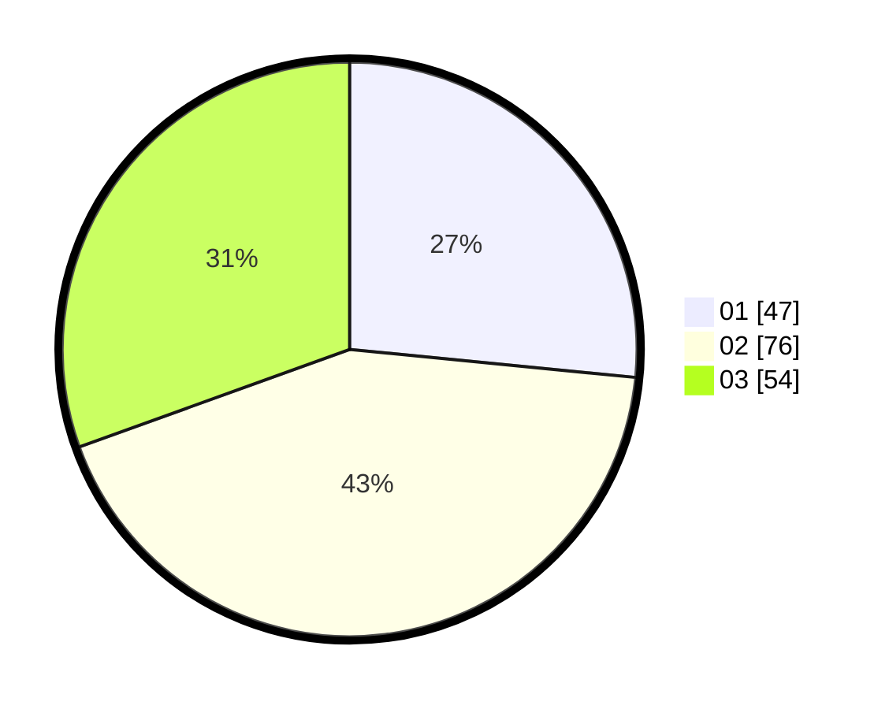

# Hasil

Hasil perolehan suara paslon dapat dilihat pada file paslon-01.txt, paslon-02.txt, dan paslon-03.txt.

Jika tidak ada, artinya data tersebut belum ada pada SIREKAP.

## Perolehan Suara

 * Paslon 01: **47**.
 * Paslon 02: **76**.
 * Paslon 03: **54**.

## Foto C Plano

https://sirekap-obj-formc.kpu.go.id/0944/pemilu/ppwp/31/73/03/10/08/3173031008009-20240215-235344--b003c1ea-77d8-4a50-bb4b-633184780a1b.jpg

https://sirekap-obj-formc.kpu.go.id/0944/pemilu/ppwp/31/73/03/10/08/3173031008009-20240215-235347--61e321cd-282a-4fe8-9e22-adb3fe80a4eb.jpg

https://sirekap-obj-formc.kpu.go.id/0944/pemilu/ppwp/31/73/03/10/08/3173031008009-20240215-235346--cc0cd2f2-64fc-4838-872f-a60fd11f9c25.jpg

## DATA PEMILIH TETAP

Jumlah pemilih dalam DPT: **237**.
 * L: **119**.
 * P: **118**.

## DATA PENGGUNA HAK PILIH

Jumlah pengguna hak pilih dalam DPT: **178**.
 * L: **91**.
 * P: **87**.

Jumlah pengguna hak pilih dalam DPTb: **0**.
 * L: **0**.
 * P: **0**.

Jumlah pengguna hak pilih dalam DPK: **1**.
 * L: **0**.
 * P: **1**.

Jumlah pengguna hak pilih: **179**.
 * L: **91**.
 * P: **88**.

## JUMLAH SUARA SAH DAN TIDAK SAH

JUMLAH SELURUH SUARA SAH: **177**.

JUMLAH SUARA TIDAK SAH: **2**.

JUMLAH SELURUH SUARA SAH DAN SUARA TIDAK SAH: **179**.
