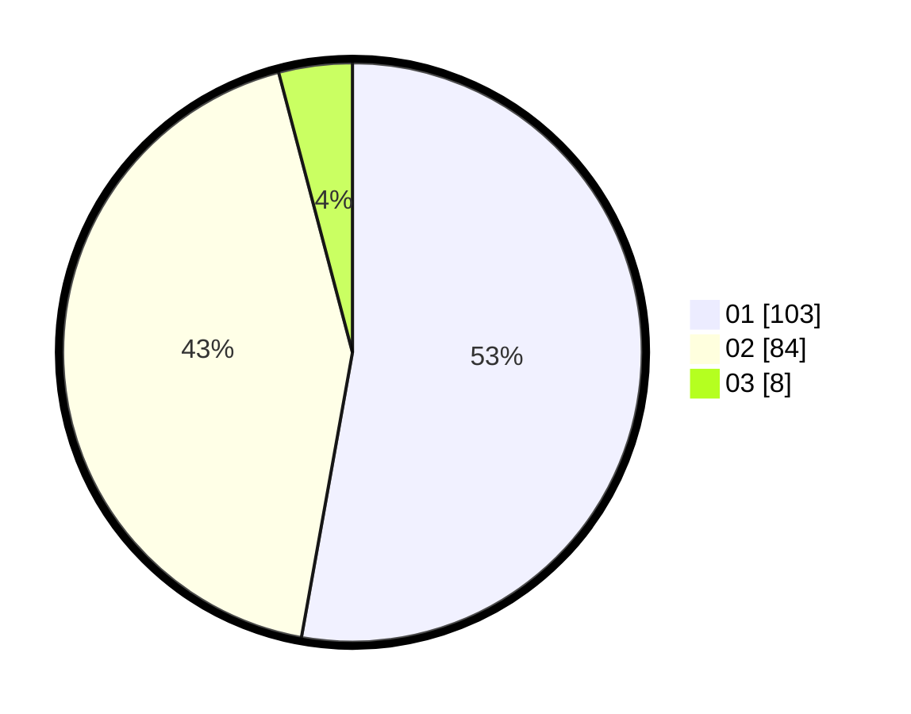

# Hasil

Hasil perolehan suara paslon dapat dilihat pada file paslon-01.txt, paslon-02.txt, dan paslon-03.txt.

Jika tidak ada, artinya data tersebut belum ada pada SIREKAP.

## Perolehan Suara

 * Paslon 01: **103**.
 * Paslon 02: **84**.
 * Paslon 03: **8**.

## Foto C Plano

https://sirekap-obj-formc.kpu.go.id/e169/pemilu/ppwp/31/73/03/10/08/3173031008011-20240214-225257--cac0396e-5805-4293-ac9d-6cb56e6fea22.jpg

https://sirekap-obj-formc.kpu.go.id/e169/pemilu/ppwp/31/73/03/10/08/3173031008011-20240214-225108--bade79f6-a117-4b38-bfbe-1588a758d5c3.jpg
