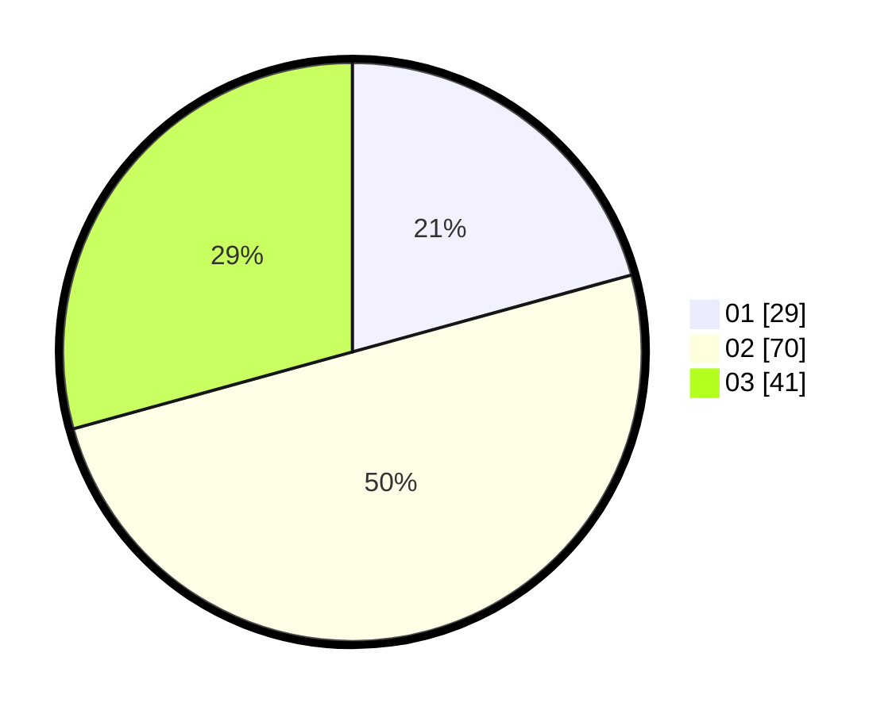

# Hasil

Hasil perolehan suara paslon dapat dilihat pada file paslon-01.txt, paslon-02.txt, dan paslon-03.txt.

Jika tidak ada, artinya data tersebut belum ada pada SIREKAP.

## Perolehan Suara

 * Paslon 01: **29**.
 * Paslon 02: **70**.
 * Paslon 03: **41**.

## Foto C Plano

https://sirekap-obj-formc.kpu.go.id/ecac/pemilu/ppwp/31/73/03/10/08/3173031008013-20240214-155349--7efac92c-b749-459d-9a94-f84fad932dec.jpg

https://sirekap-obj-formc.kpu.go.id/ecac/pemilu/ppwp/31/73/03/10/08/3173031008013-20240214-155535--6000ca9f-f1f0-4a6e-a554-8e8f8d336d71.jpg

https://sirekap-obj-formc.kpu.go.id/ecac/pemilu/ppwp/31/73/03/10/08/3173031008013-20240214-155758--38525f85-d438-446a-af76-fe3228c58551.jpg

## DATA PEMILIH TETAP

Jumlah pemilih dalam DPT: **214**.
 * L: **105**.
 * P: **109**.

## DATA PENGGUNA HAK PILIH

Jumlah pengguna hak pilih dalam DPT: **139**.
 * L: **67**.
 * P: **72**.

Jumlah pengguna hak pilih dalam DPTb: **1**.
 * L: **0**.
 * P: **1**.

Jumlah pengguna hak pilih dalam DPK: **1**.
 * L: **0**.
 * P: **1**.

Jumlah pengguna hak pilih: **141**.
 * L: **67**.
 * P: **74**.

## JUMLAH SUARA SAH DAN TIDAK SAH

JUMLAH SELURUH SUARA SAH: **140**.

JUMLAH SUARA TIDAK SAH: **1**.

JUMLAH SELURUH SUARA SAH DAN SUARA TIDAK SAH: **141**.
