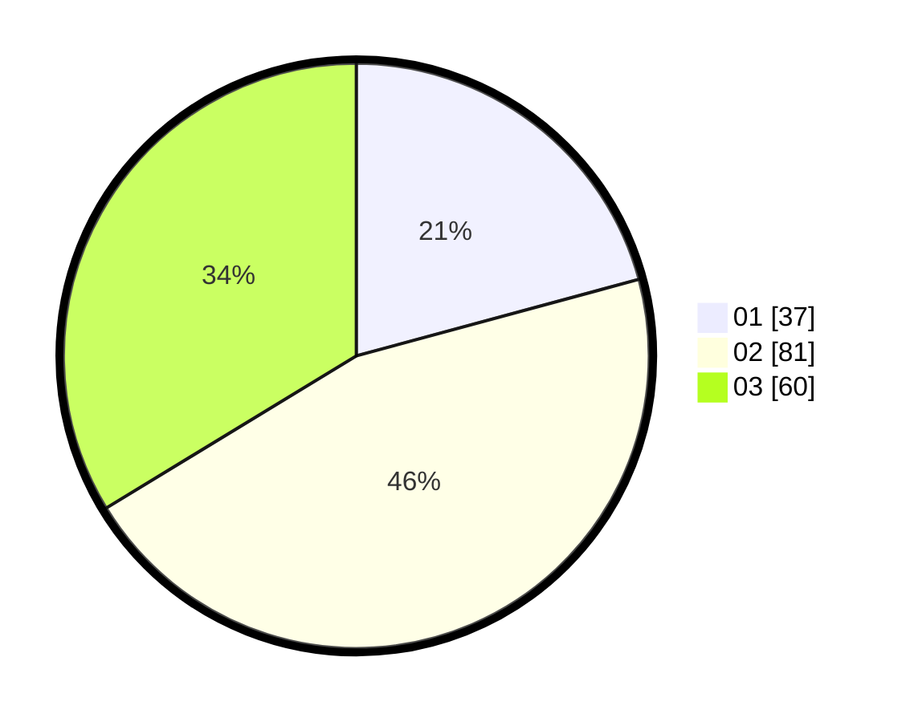

# Hasil

Hasil perolehan suara paslon dapat dilihat pada file paslon-01.txt, paslon-02.txt, dan paslon-03.txt.

Jika tidak ada, artinya data tersebut belum ada pada SIREKAP.

## Perolehan Suara

 * Paslon 01: **37**.
 * Paslon 02: **81**.
 * Paslon 03: **60**.

## Foto C Plano

https://sirekap-obj-formc.kpu.go.id/db73/pemilu/ppwp/31/73/03/10/08/3173031008017-20240216-055018--80330ed9-41ac-4cc8-902a-b9ae16cff764.jpg

https://sirekap-obj-formc.kpu.go.id/db73/pemilu/ppwp/31/73/03/10/08/3173031008017-20240216-055027--db3dddba-e12e-4e51-a705-f7dc05331b6e.jpg

https://sirekap-obj-formc.kpu.go.id/db73/pemilu/ppwp/31/73/03/10/08/3173031008017-20240216-055022--a6c7a908-ee02-43af-921d-6c4e84732f74.jpg

## DATA PEMILIH TETAP

Jumlah pemilih dalam DPT: **265**.
 * L: **128**.
 * P: **137**.

## DATA PENGGUNA HAK PILIH

Jumlah pengguna hak pilih dalam DPT: **179**.
 * L: **85**.
 * P: **94**.

Jumlah pengguna hak pilih dalam DPTb: **0**.
 * L: **0**.
 * P: **0**.

Jumlah pengguna hak pilih dalam DPK: **3**.
 * L: **2**.
 * P: **1**.

Jumlah pengguna hak pilih: **182**.
 * L: **87**.
 * P: **95**.

## JUMLAH SUARA SAH DAN TIDAK SAH

JUMLAH SELURUH SUARA SAH: **178**.

JUMLAH SUARA TIDAK SAH: **4**.

JUMLAH SELURUH SUARA SAH DAN SUARA TIDAK SAH: **182**.
