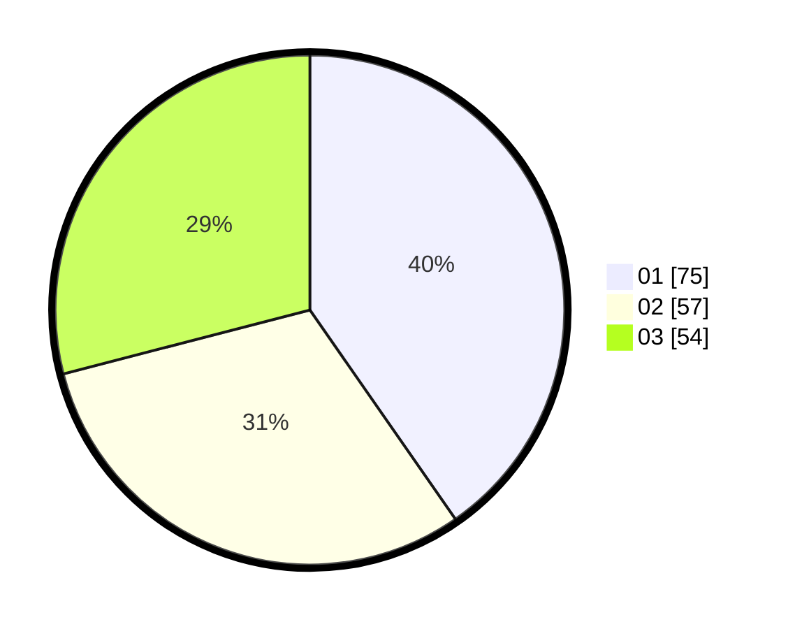

# Hasil

Hasil perolehan suara paslon dapat dilihat pada file paslon-01.txt, paslon-02.txt, dan paslon-03.txt.

Jika tidak ada, artinya data tersebut belum ada pada SIREKAP.

## Perolehan Suara

 * Paslon 01: **75**.
 * Paslon 02: **57**.
 * Paslon 03: **54**.

## Foto C Plano

https://sirekap-obj-formc.kpu.go.id/7f90/pemilu/ppwp/31/73/03/10/08/3173031008020-20240214-190051--5131d87f-84e3-4f45-9e78-8878f51476f5.jpg

https://sirekap-obj-formc.kpu.go.id/7f90/pemilu/ppwp/31/73/03/10/08/3173031008020-20240214-231041--f211262d-b6b5-491a-9676-a62c30f141e9.jpg

https://sirekap-obj-formc.kpu.go.id/7f90/pemilu/ppwp/31/73/03/10/08/3173031008020-20240214-190245--030f786d-65a7-44ee-91c3-0e788eb4780f.jpg
