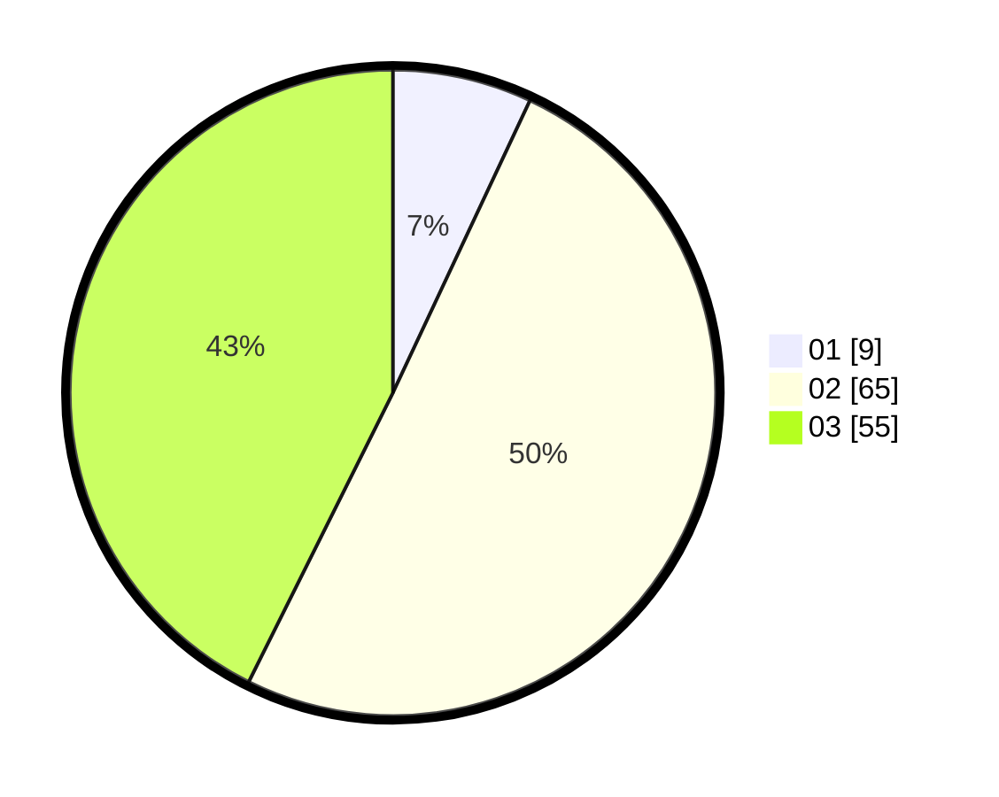

# Hasil

Hasil perolehan suara paslon dapat dilihat pada file paslon-01.txt, paslon-02.txt, dan paslon-03.txt.

Jika tidak ada, artinya data tersebut belum ada pada SIREKAP.

## Perolehan Suara

 * Paslon 01: **9**.
 * Paslon 02: **65**.
 * Paslon 03: **55**.

## Foto C Plano

https://sirekap-obj-formc.kpu.go.id/7510/pemilu/ppwp/31/73/03/10/08/3173031008023-20240214-231504--e80f875a-1572-439d-9430-826aea3fe461.jpg

https://sirekap-obj-formc.kpu.go.id/7510/pemilu/ppwp/31/73/03/10/08/3173031008023-20240214-231547--768ae10a-366d-4e33-91ba-d1a11fa528b9.jpg
