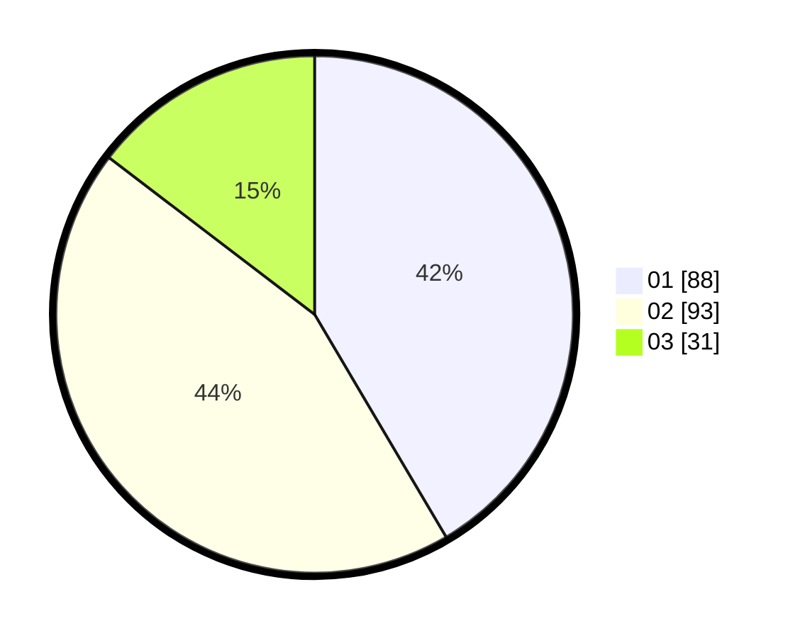

# Hasil

Hasil perolehan suara paslon dapat dilihat pada file paslon-01.txt, paslon-02.txt, dan paslon-03.txt.

Jika tidak ada, artinya data tersebut belum ada pada SIREKAP.

## Perolehan Suara

 * Paslon 01: **88**.
 * Paslon 02: **93**.
 * Paslon 03: **31**.

## Foto C Plano

https://sirekap-obj-formc.kpu.go.id/53ee/pemilu/ppwp/31/73/03/10/08/3173031008030-20240216-135846--a2bfc36e-9b3b-4f5d-b9be-586fb84591dd.jpg

https://sirekap-obj-formc.kpu.go.id/53ee/pemilu/ppwp/31/73/03/10/08/3173031008030-20240216-135847--4da32301-743f-45d1-b2cc-8f71dcdda3f9.jpg

https://sirekap-obj-formc.kpu.go.id/53ee/pemilu/ppwp/31/73/03/10/08/3173031008030-20240216-135847--030091bc-9714-4c8e-a6de-a2e380029391.jpg

## DATA PEMILIH TETAP

Jumlah pemilih dalam DPT: **253**.
 * L: **141**.
 * P: **112**.

## DATA PENGGUNA HAK PILIH

Jumlah pengguna hak pilih dalam DPT: **202**.
 * L: **108**.
 * P: **94**.

Jumlah pengguna hak pilih dalam DPTb: **16**.
 * L: **6**.
 * P: **10**.

Jumlah pengguna hak pilih dalam DPK: **0**.
 * L: **0**.
 * P: **0**.

Jumlah pengguna hak pilih: **218**.
 * L: **114**.
 * P: **104**.

## JUMLAH SUARA SAH DAN TIDAK SAH

JUMLAH SELURUH SUARA SAH: **212**.

JUMLAH SUARA TIDAK SAH: **6**.

JUMLAH SELURUH SUARA SAH DAN SUARA TIDAK SAH: **218**.
