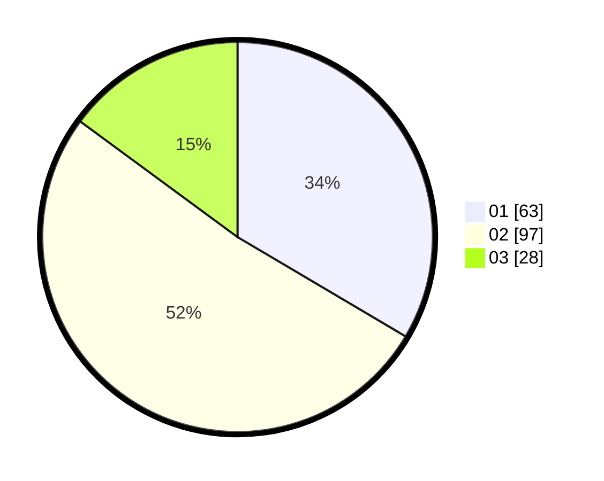

# Hasil

Hasil perolehan suara paslon dapat dilihat pada file paslon-01.txt, paslon-02.txt, dan paslon-03.txt.

Jika tidak ada, artinya data tersebut belum ada pada SIREKAP.

## Perolehan Suara

 * Paslon 01: **63**.
 * Paslon 02: **97**.
 * Paslon 03: **28**.

## Foto C Plano

https://sirekap-obj-formc.kpu.go.id/e011/pemilu/ppwp/31/73/03/10/08/3173031008032-20240214-193441--8caf7618-3de1-4d01-ab6d-0bf94b42bc27.jpg

https://sirekap-obj-formc.kpu.go.id/e011/pemilu/ppwp/31/73/03/10/08/3173031008032-20240214-193446--4b2799a8-0572-4082-8ff9-dd7b268974d3.jpg

https://sirekap-obj-formc.kpu.go.id/e011/pemilu/ppwp/31/73/03/10/08/3173031008032-20240214-234034--05bd3fec-43da-4882-9496-2ea998f547f4.jpg

## DATA PEMILIH TETAP

Jumlah pemilih dalam DPT: **246**.
 * L: **132**.
 * P: **114**.

## DATA PENGGUNA HAK PILIH

Jumlah pengguna hak pilih dalam DPT: **186**.
 * L: **99**.
 * P: **87**.

Jumlah pengguna hak pilih dalam DPTb: **0**.
 * L: **0**.
 * P: **0**.

Jumlah pengguna hak pilih dalam DPK: **5**.
 * L: **3**.
 * P: **2**.

Jumlah pengguna hak pilih: **191**.
 * L: **102**.
 * P: **89**.

## JUMLAH SUARA SAH DAN TIDAK SAH

JUMLAH SELURUH SUARA SAH: **188**.

JUMLAH SUARA TIDAK SAH: **3**.

JUMLAH SELURUH SUARA SAH DAN SUARA TIDAK SAH: **191**.
