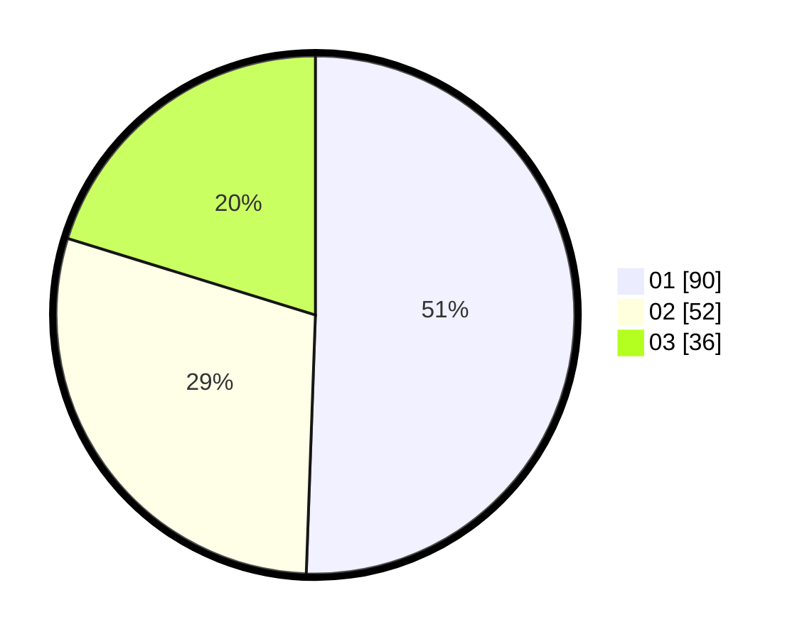

# Hasil

Hasil perolehan suara paslon dapat dilihat pada file paslon-01.txt, paslon-02.txt, dan paslon-03.txt.

Jika tidak ada, artinya data tersebut belum ada pada SIREKAP.

## Perolehan Suara

 * Paslon 01: **90**.
 * Paslon 02: **52**.
 * Paslon 03: **36**.

## Foto C Plano

https://sirekap-obj-formc.kpu.go.id/c079/pemilu/ppwp/31/73/03/10/08/3173031008037-20240214-200553--16b7f3fe-bc4b-431e-83ac-3f16dfbd0aad.jpg

https://sirekap-obj-formc.kpu.go.id/c079/pemilu/ppwp/31/73/03/10/08/3173031008037-20240214-201702--9783b4ba-6507-475e-9c70-519b852a11c7.jpg

https://sirekap-obj-formc.kpu.go.id/c079/pemilu/ppwp/31/73/03/10/08/3173031008037-20240214-201837--5be63d9c-f019-4248-af3f-17fc721ccc25.jpg
